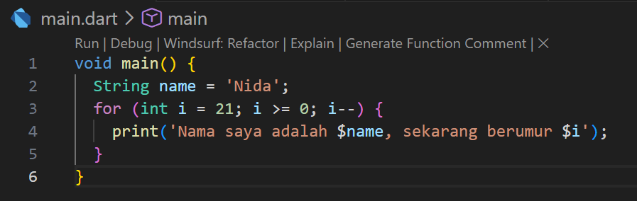
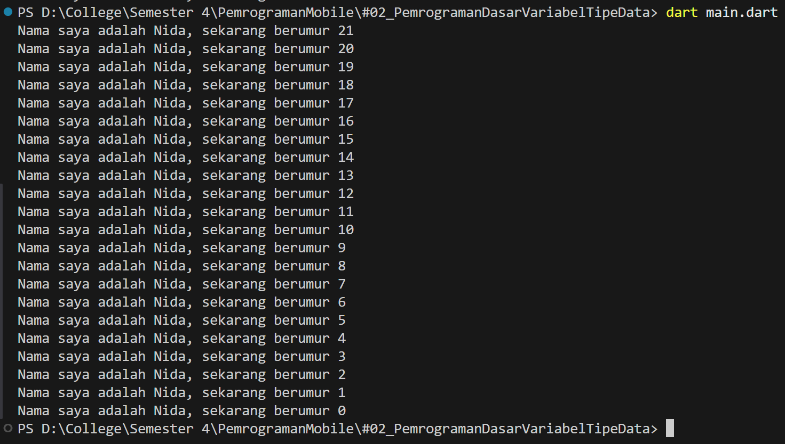
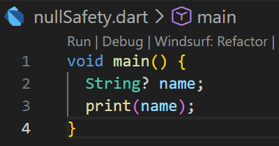
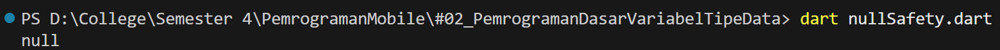
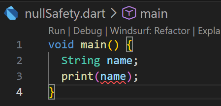
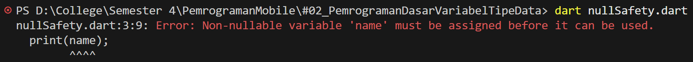
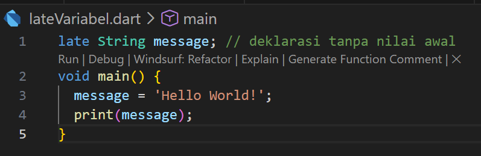
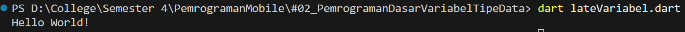
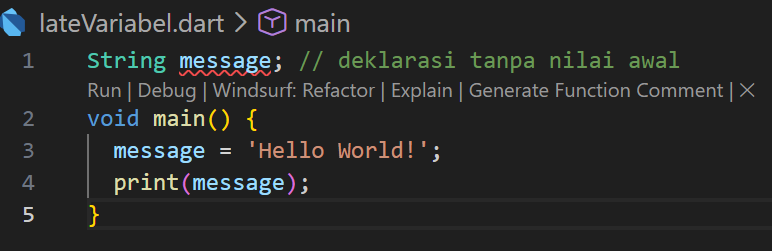
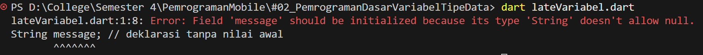

# Laporan Praktikum #02 - Pemrograman Dasar Dart - Bag.1 (Variabel dan Tipe Data)

Naswanida Nafiula <br>
SIB 2E / 13 <br>
244107060063 <br>

---

## Tugas Praktikum 2
### Soal 1
Modifikasilah kode pada baris 3 di VS Code atau Editor Code favorit Anda berikut ini agar mendapatkan keluaran (output) sesuai yang diminta!

```dart
void main() {
  for (int i = 0; i < 10; i++) {
    print('hello ${i + 2}');
  }
}
```

**Jawaban:**





---

### Soal 2
Mengapa sangat penting untuk memahami bahasa pemrograman Dart sebelum kita menggunakan framework Flutter ? Jelaskan!

**Jawaban:**
Penting untuk memahami pemrograman dart karena flutter dibangun menggunakan dart, sehingga jika tidak memahami dart, tidak memungkinkan untuk menulis kode flutter. Dart mengajarkan fondasi seperti variabel, fungsi, OOP, dan Null Safety Widget Flutter adalah class Dart, sehingga pemahaman Dart menentukan seberapa efektif dalam membangun dan men-debug aplikasi.

---

### Soal 3
Rangkumlah materi dari codelab ini menjadi poin-poin penting yang dapat Anda gunakan untuk membantu proses pengembangan aplikasi mobile menggunakan framework Flutter.

**Jawaban:**
1. Dart merupakan bahasa berorientasi objek (OOP) yang mendukung encapsulation, inheritance, composition, abstraction, dan polymorphism
2. Semua tipe data di Dart adalah objek (turunan dari class), tidak ada tipe primitif seperti di Java
3. Tipe data utama: `String`, `int`, `double`, `bool`, `List`, `Map`
4. Deklarasi variabel menggunakan `var`, `final`, atau `const` sesuai kebutuhan
5. Null Safety aktif secara default, variabel tidak boleh null kecuali diberi tanda `?`
6. Late digunakan untuk mendeklarasikan variabel yang pasti diisi sebelum digunakan namun diinisialisasi belakangan
7. Operator di Dart merupakan method dalam class sehingga dapat di-override
8. Operator aritmatika: `+`, `-`, `*`, `/`, `~/`, `%` beserta shortcut `+=`, `-=`, dan lainnya
9. Operator `==` membandingkan isi variabel, bukan referensi memori
10. Dart memiliki type safety sehingga tidak memerlukan `===` seperti JavaScript
11. Operator logika: `!` (negasi), `||` (OR), `&&` (AND)

---

### Soal 4
Buatlah penjelasan dan contoh eksekusi kode tentang perbedaan Null Safety dan Late variabel !

**Jawaban:**
#### Null Safety
Null Safety adalah fitur Dart yang memastikan variabel tidak bisa bernilai null secara default. Tujuannya untuk mencegah error `Null Pointer Exception` yang sering terjadi di bahasa pemrograman lain. Jika suatu variabel memang perlu bernilai null, maka harus dideklarasikan secara eksplisit dengan menambahkan tanda `?` pada tipe datanya.

**Contoh jika pakai null safety :**



Kode tersebut berhasil dijalankan karena variabel `name` dideklarasikan dengan tanda `?` (`String? name`) yang menandakan variabel tersebut bersifat nullable. Dart mengizinkan variabel tanpa nilai untuk diakses dan secara otomatis menganggapnya bernilai `null`, sehingga output yang dihasilkan adalah `null` tanpa error.

**Contoh jika tidak pakai null safety :**



Kode tersebut menghasilkan error `Non-nullable variable 'name' must be assigned before it can be used` karena variabel `name` dideklarasikan sebagai `String` tanpa tanda `?`, yang berarti variabel tersebut bersifat non-nullable. Fitur Null Safety pada Dart mencegah variabel non-nullable diakses sebelum diisi nilai, sehingga program gagal dijalankan.

#### Late Variabel
Late adalah keyword yang digunakan untuk mendeklarasikan variabel non-nullable yang belum bisa diinisialisasi pada saat deklarasi, namun dijamin akan diisi sebelum variabel tersebut diakses. Berbeda dengan nullable (`?`) yang nilai awalnya otomatis null, variabel `late` tidak memiliki nilai apapun hingga secara eksplisit diisi. Jika variabel `late` diakses sebelum diisi, program akan menghasilkan **LateInitializationError**.

**Contoh jika pakai late variabel :**



Kode tersebut berhasil dijalankan karena variabel `message` dideklarasikan menggunakan keyword `late`, yang memberitahu Dart bahwa variabel akan diisi sebelum digunakan. Meskipun dideklarasikan di luar `void main()` tanpa nilai awal, program tetap berjalan normal dan menghasilkan output `Hello World!`.

**Contoh jika tidak pakai late variabel :**



Kode tersebut menghasilkan error `Field 'message' should be initialized because its type 'String' doesn't allow null` karena variabel `message` dideklarasikan sebagai `String` biasa tanpa keyword `late`. Dart mengharuskan variabel non-nullable yang dideklarasikan di luar fungsi untuk langsung diinisialisasi dengan nilai, sehingga program gagal dijalankan.