# Laporan Praktikum #03 - Pemrograman Dasar Dart - Bag.2 (Percabangan dan Perulangan)

Naswanida Nafiula <br>
SIB 2E / 13 <br>
244107060063 <br>

---

## Praktikum 1: Menerapkan Control Flows ("if/else")
### Langkah 1:
Ketik atau salin kode program berikut ke dalam fungsi `main()`.

```dart
void main() {
  String test = "test2";
  if (test == "test1") {
    print("Test1");
  } else If (test == "test2") {
    print("Test2");
  } Else {
    print("Something else");
  }

  if (test == "test2") print("Test2 again");
}
```

### Langkah 2:
Silakan coba eksekusi (Run) kode pada langkah 1 tersebut. Apa yang terjadi? Jelaskan!

**Jawab:**

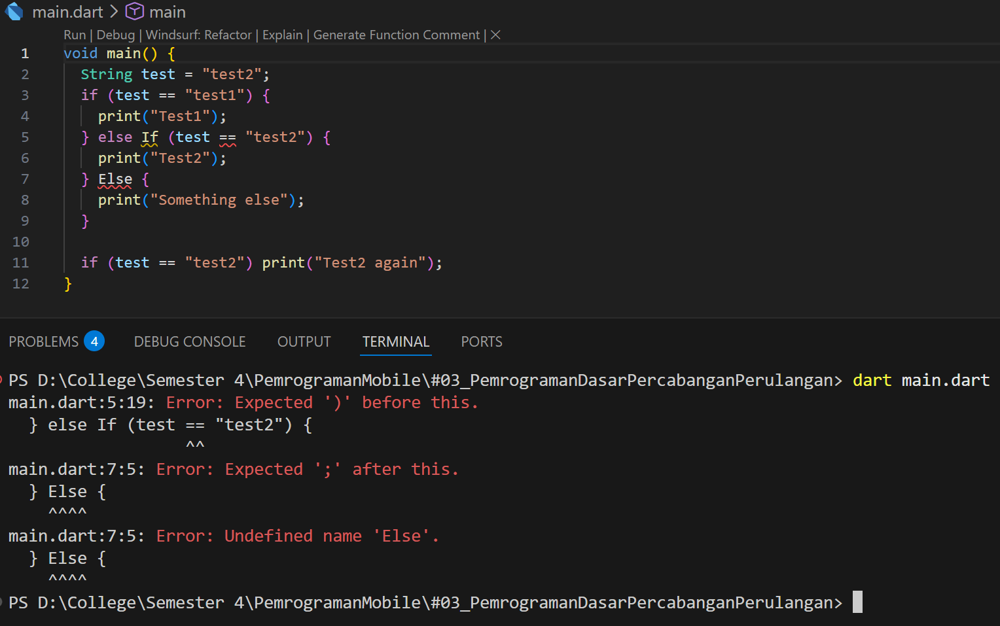
Terdapat dua kesalahan penulisan sintaks pada kode tersebut. Pertama, pada baris 5 keyword `else if` ditulis sebagai `else If` dengan huruf `I` kapital, padahal Dart bersifat case-sensitive sehingga semua keyword harus ditulis dengan huruf kecil. Kedua, pada baris 7 keyword `else` ditulis sebagai `Else` dengan huruf `E` kapital yang menyebabkan Dart tidak mengenalinya sebagai keyword dan memunculkan error `Undefined name 'Else'`. Kedua kesalahan tersebut menyebabkan program gagal dijalankan. Penulisan yang benar yaitu `else` dan `if` dengan huruf kecil semua. Berikut kode yang benar :

```dart
void main() {
  String test = "test2";
  if (test == "test1") {
    print("Test1");
  } else if (test == "test2") {
    print("Test2");
  } else {
    print("Something else");
  }

  if (test == "test2") print("Test2 again");
}
```

Outputnya setelah diperbaiki:
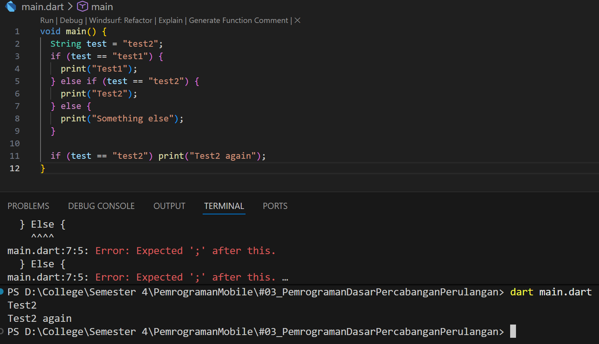
Setelah dilakukan perbaikan dengan mengubah keyword `Else` dan `If` menjadi huruf kecil `else` dan `else if`, program berhasil dijalankan tanpa error. Output yang dihasilkan adalah `Test2` dan `Test2 again` karena variabel `test` bernilai `"test2"`, sehingga kondisi `else if (test == "test2")` terpenuhi dan mencetak `Test2`, kemudian kondisi `if (test == "test2")` pada baris 11 juga terpenuhi dan mencetak `Test2 again`. Hal ini membuktikan bahwa Dart bersifat case-sensitive dan penulisan keyword harus menggunakan huruf kecil.


### Langkah 3:
Tambahkan kode program berikut, lalu coba eksekusi (Run) kode Anda.

```dart
String test = "true";
  if (test) {
    print("Kebenaran");
  }
```

Apa yang terjadi ? Jika terjadi error, silakan perbaiki namun tetap menggunakan if/else.

**Jawab:**

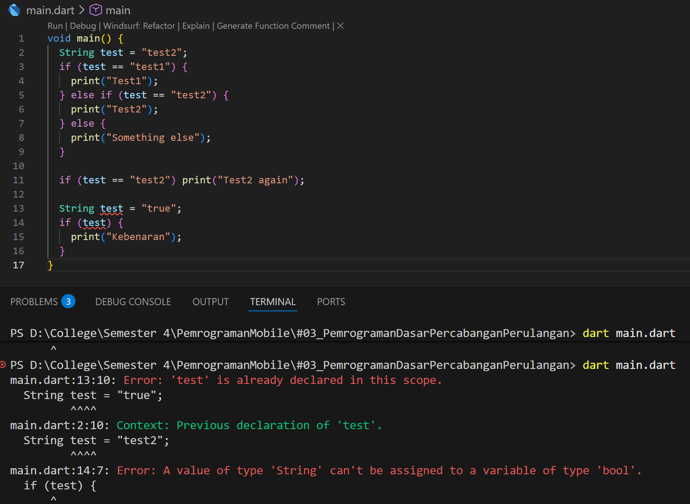
Terjadi dua error. Pertama, variabel `test` sudah dideklarasikan sebelumnya di baris 2 sehingga muncul error `'test' is already declared in this scope`. Kedua, kondisi `if (test)` menghasilkan error `A value of type 'String' can't be assigned to a variable of type 'bool'` karena Dart mengharuskan kondisi `if` bernilai `bool`, bukan `String`.

Berikut kode yang diperbaiki dengan tetap menggunakan if/else:

```dart
String test2 = "true";
  if (test2 == "true") {
    print("Kebenaran");
  } else {
    print("Bukan kebenaran");
  }
```

Outputnya setelah diperbaiki:
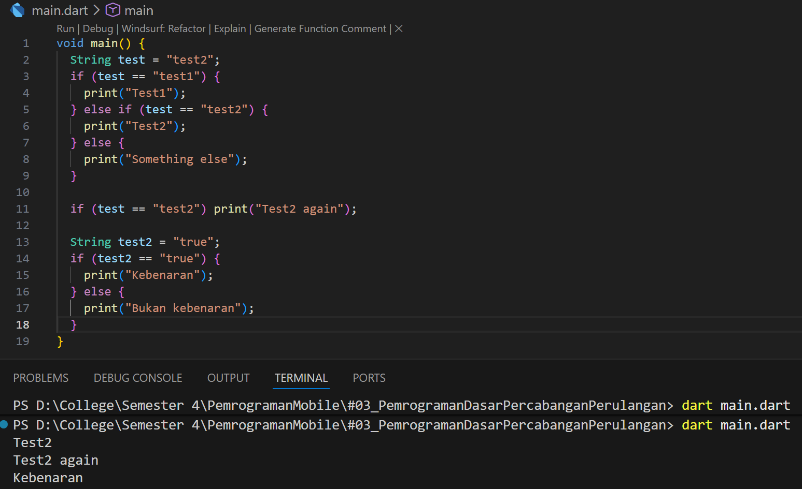
Setelah dilakukan perbaikan dengan mengganti nama variabel menjadi `test2` dan mengubah kondisi `if (test2)` menjadi `if (test2 == "true")`, program berhasil dijalankan tanpa error. Output yang dihasilkan adalah `Test2`, `Test2 again`, dan `Kebenaran`. Variabel `test2` bernilai `"true"` sehingga kondisi `if (test2 == "true")` terpenuhi dan mencetak `Kebenaran`. Hal ini membuktikan bahwa kondisi `if` di Dart harus menghasilkan nilai `bool`, sehingga perbandingan `String` harus dilakukan menggunakan operator `==`.

---

## Praktikum 2: Menerapkan Perulangan "while" dan "do-while"
### Langkah 1:
Ketik atau salin kode program berikut ke dalam fungsi `main()`.

```dart
void main() {
  while (counter < 33) {
    print(counter);
    counter++;
  }
}
```

### Langkah 2:
Silakan coba eksekusi (Run) kode pada langkah 1 tersebut. Apa yang terjadi? Jelaskan! Lalu perbaiki jika terjadi error.

**Jawab:**

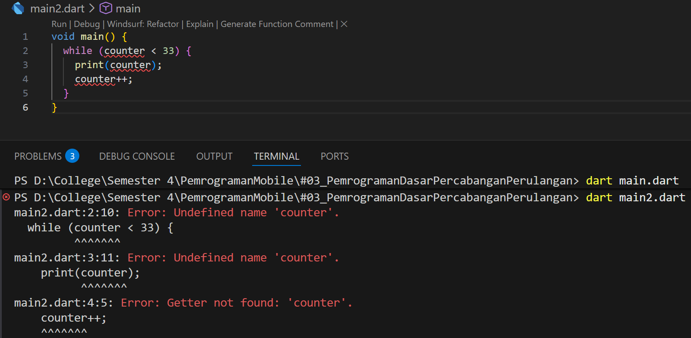
Terjadi error `Undefined name 'counter'` karena variabel `counter` langsung digunakan dalam kondisi `while` tanpa dideklarasikan terlebih dahulu. Dart mengharuskan setiap variabel dideklarasikan beserta tipe datanya sebelum bisa digunakan, sehingga program gagal dijalankan di seluruh baris yang menggunakan `counter`. Berikut kode yang benar :

```dart
void main() {
  int counter = 0;
  while (counter < 33) {
    print(counter);
    counter++;
  }
}
```

Outputnya setelah diperbaiki:
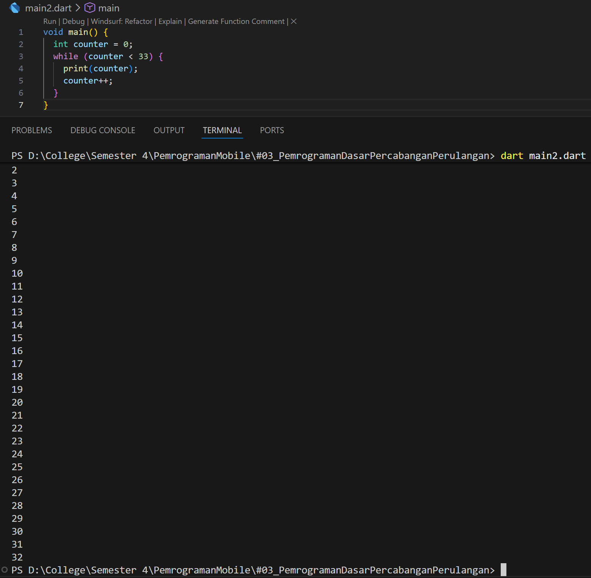
Setelah dilakukan perbaikan dengan menambahkan deklarasi `int counter = 0` sebelum loop, program berhasil dijalankan dan mencetak angka dari 0 hingga 32. Loop `while` terus berjalan selama nilai `counter` kurang dari 33, dan setiap iterasi nilai `counter` bertambah 1 menggunakan operator `counter++`. Angka 33 tidak ikut dicetak karena kondisi `counter < 33` menjadi `false` saat `counter` mencapai nilai tersebut, sehingga loop berhenti.


### Langkah 3:
Tambahkan kode program berikut, lalu coba eksekusi (Run) kode Anda.

```dart
  do {
    print(counter);
    counter++;
  } while (counter < 77);
```

Apa yang terjadi ? Jika terjadi error, silakan perbaiki namun tetap menggunakan *do-while*.

**Jawab:**

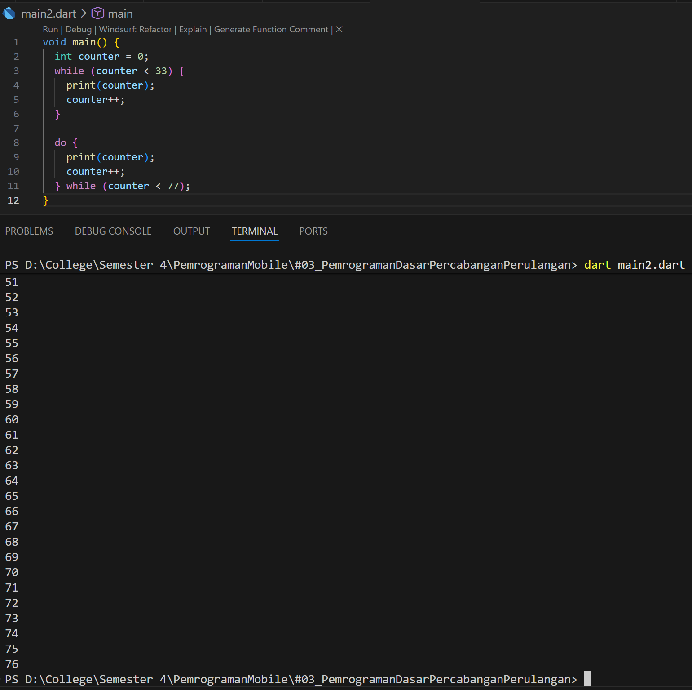
Kode `do-while` ditambahkan langsung setelah loop `while` sebelumnya. Karena variabel `counter` setelah loop `while` sudah bernilai 33, maka loop `do-while` akan mencetak angka mulai dari 33 hingga 76, karena `do-while` mengeksekusi blok kode terlebih dahulu sebelum mengecek kondisi `counter < 77`.

---

## Praktikum 3: Menerapkan Perulangan "for" dan "break-continue"
### Langkah 1:
Ketik atau salin kode program berikut ke dalam fungsi `main()`.

```dart
void main() {
  for (Index = 10; index < 27; index) {
    print(Index);
  }
}
```

### Langkah 2:
Silakan coba eksekusi (Run) kode pada langkah 1 tersebut. Apa yang terjadi? Jelaskan! Lalu perbaiki jika terjadi error.

**Jawab:**

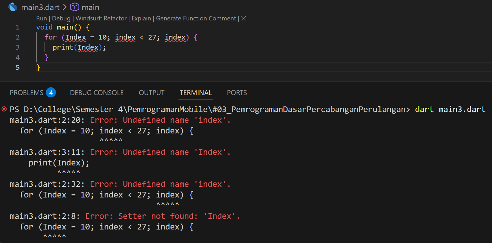
Terjadi beberapa error karena Dart bersifat case-sensitive. Variabel ditulis dengan nama yang tidak konsisten yaitu `Index` dengan huruf kapital di awal dan `index` dengan huruf kecil dianggap sebagai dua variabel berbeda oleh Dart, padahal keduanya belum dideklarasikan sama sekali sehingga muncul error `Undefined name 'Index'` dan `Undefined name 'index'`. Selain itu, bagian increment pada `for hanya ditulis `index` tanpa operator ++ sehingga nilai tidak bertambah. Berikut kode yang benar :

```dart
void main() {
  for (int index = 10; index < 27; index++) {
    print(index);
  }
}
```

Outputnya setelah diperbaiki:
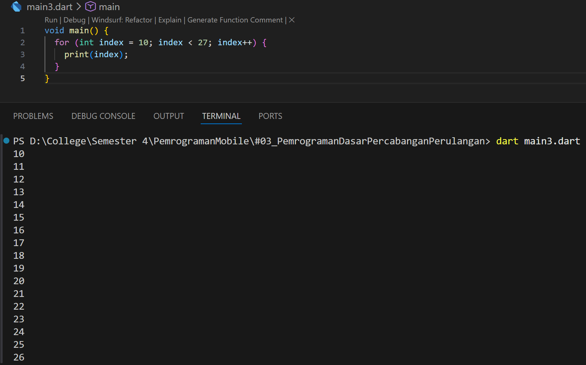
Setelah dilakukan perbaikan dengan mendeklarasikan variabel menggunakan `int index = 10`, menyamakan penulisan nama variabel menjadi `index` secara konsisten, dan menambahkan operator `++` pada bagian increment, program berhasil dijalankan tanpa error. Output yang dihasilkan adalah angka 10 hingga 26 karena loop dimulai dari `index = 10` dan berhenti saat `index` mencapai 27 akibat kondisi `index < 27`.


### Langkah 3:
Tambahkan kode program berikut di dalam *for-loop*, lalu coba eksekusi (Run) kode Anda.

```dart
  If (Index == 21) break;
  Else If (index > 1 || index < 7) continue;
  print(index);
```

Apa yang terjadi ? Jika terjadi error, silakan perbaiki namun tetap menggunakan *for* dan *break-continue*.

**Jawab:**

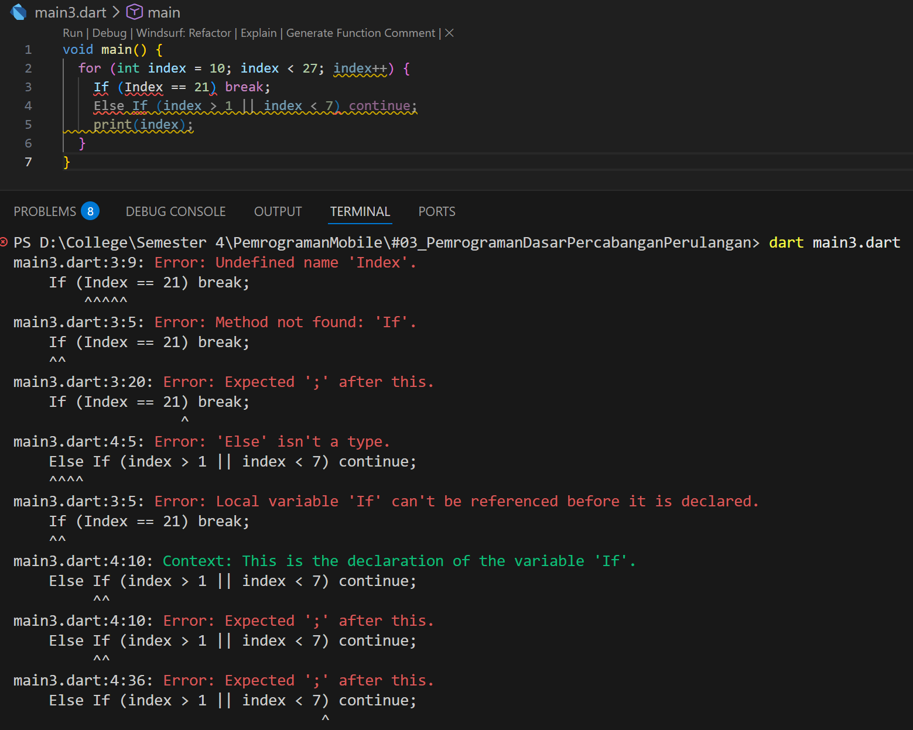
Terjadi beberapa error karena penulisan keyword tidak sesuai aturan Dart. `Index` ditulis dengan huruf kapital sehingga muncul error `Undefined name 'Index'` karena variabel yang dideklarasikan adalah `index` dengan huruf kecil. Keyword `Else` ditulis dengan huruf kapital sehingga muncul error `'Else' isn't a type`. Selain itu muncul error `Expected ';' after this` akibat dari kesalahan penulisan keyword tersebut, dan `Local variable 'If' can't be referenced before it is declared` karena Dart mencoba mengartikan `If` sebagai variabel bukan keyword.

Berikut kode yang diperbaiki dengan tetap menggunakan *for* dan *break-continue*:

```dart
    if (index == 21) break;
    else if (index > 1 || index < 7) continue;
    print(index);
```

Outputnya setelah diperbaiki:
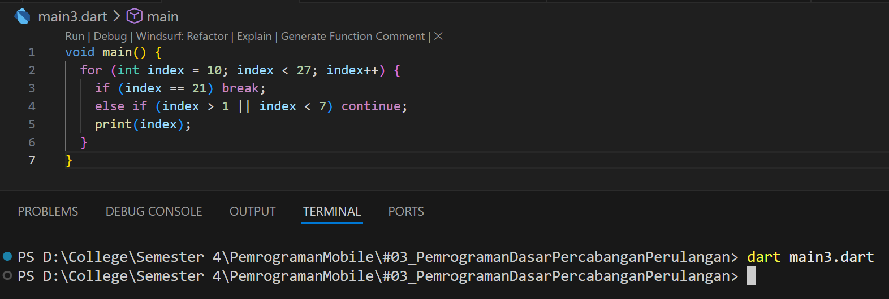
Program berhasil dijalankan tanpa error setelah perbaikan dilakukan, namun tidak menghasilkan output apapun. Hal ini terjadi karena kondisi `else if (index > 1 || index < 7)` selalu bernilai `true` untuk semua nilai `index` yang dimulai dari 10, karena setiap angka di atas 10 pasti lebih besar dari 1. Akibatnya, `continue` terus dieksekusi setiap iterasi sehingga `print(index)` tidak pernah tercapai, dan loop berhenti saat `index` mencapai 21 karena kondisi `break` terpenuhi.

---

## Tugas Praktikum
Buatlah sebuah program yang dapat menampilkan bilangan prima dari angka 0 sampai 201 menggunakan Dart. Ketika bilangan prima ditemukan, maka tampilkan nama lengkap dan NIM Anda.

**Jawab:**

```dart
void main() {
  String nama = "Naswanida Nafiula";
  String nim = "244107060063";
  
  for (int i = 0; i <= 201; i++) {
    bool isPrime = true;
    if (i < 2) {
      isPrime = false;
    } else {
      for (int j = 2; j < i; j++) {
        if (i % j == 0) {
          isPrime = false;
          break;
        }
      }
    }
    if (isPrime) {
      print('$i Bilangan Prima ditemukan: $i');
      print('    Nama: $nama | NIM: $nim');
    } else {
      print('$i');
    }
  }
}
```

Output program:

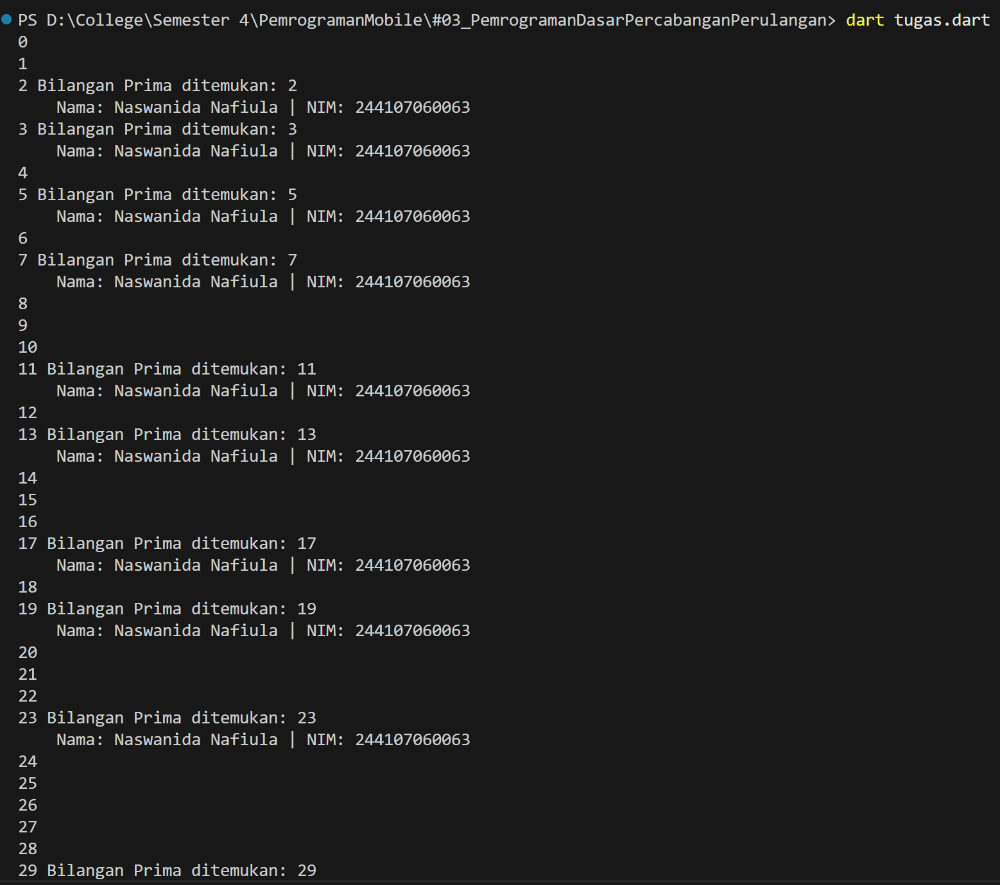
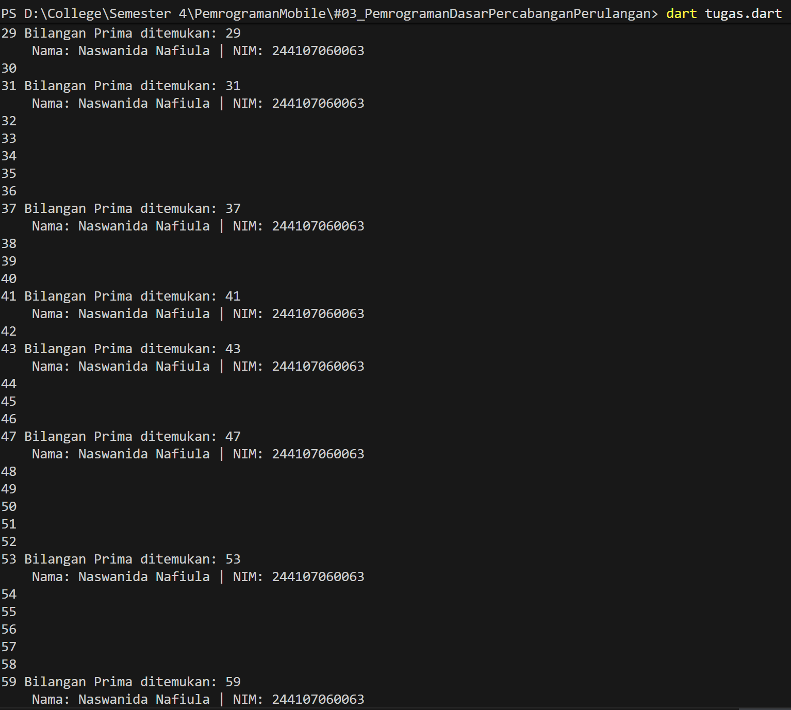
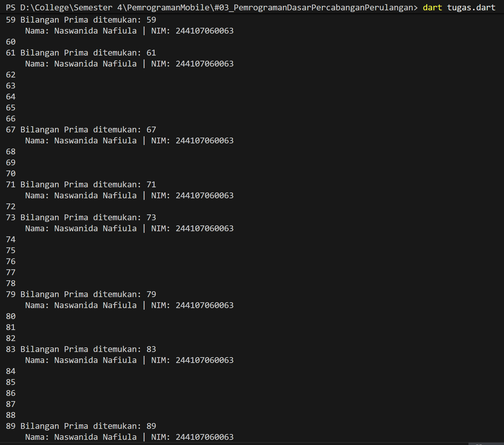
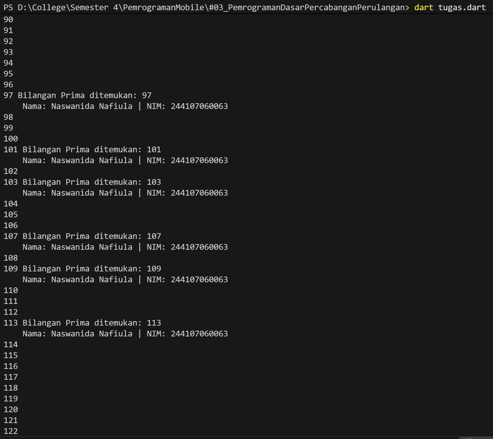
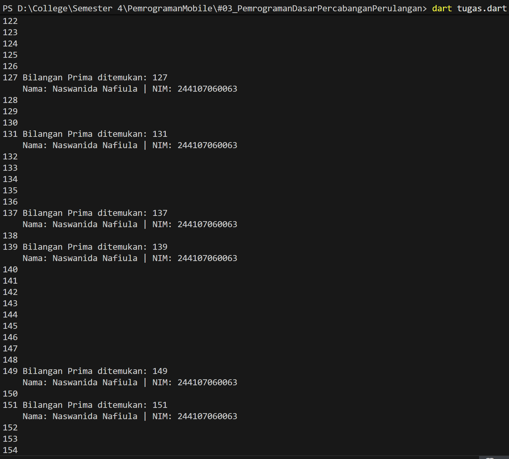
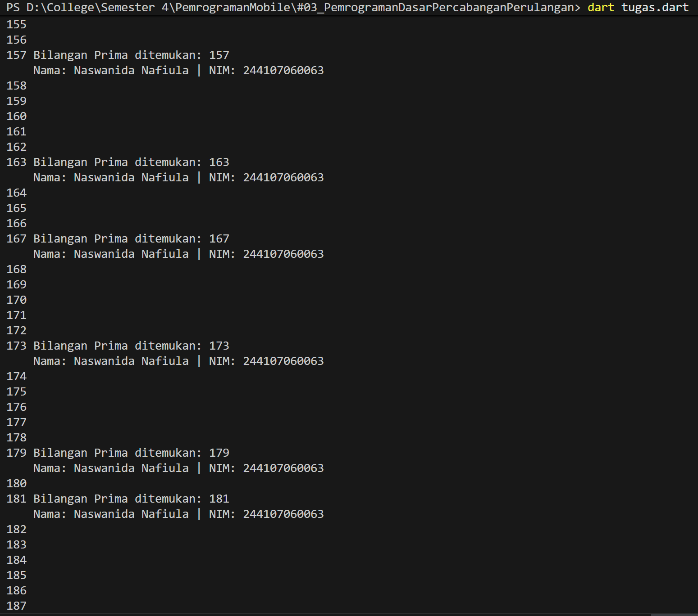
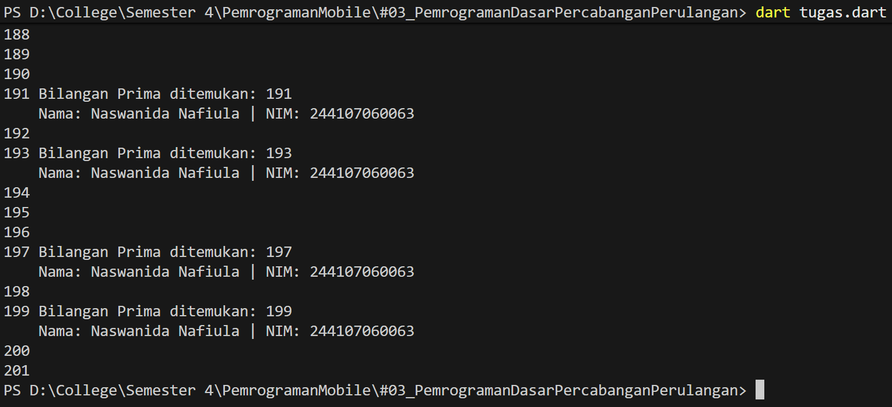
