# Laporan Praktikum #04 - Pemrograman Dasar Dart - Bag.3 (Collections dan Functions)

Naswanida Nafiula <br>
SIB 2E / 13 <br>
244107060063 <br>

---

## Praktikum 1: Eksperimen Tipe Data List
### Langkah 1:
Ketik atau salin kode program berikut ke dalam `void main()`.

```dart
void main() {
  var list = [1, 2, 3];
  assert(list.length == 3);
  assert(list[1] == 2);
  print(list.length);
  print(list[1]);

  list[1] = 1;
  assert(list[1] == 1);
  print(list[1]);
}
```

### Langkah 2:
Silakan coba eksekusi (Run) kode pada langkah 1 tersebut. Apa yang terjadi? Jelaskan!

**Jawab:**

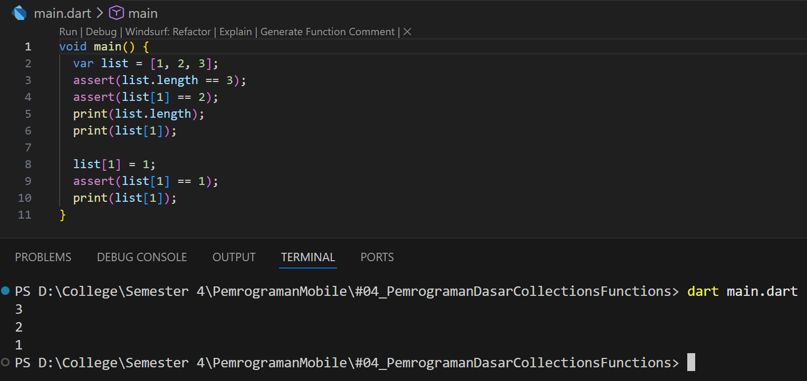
Program berhasil dijalankan tanpa error dan menghasilkan output `3`, `2`, dan `1`. `assert` adalah perintah untuk memvalidasi kondisi, jika kondisi bernilai `false` maka program akan langsung berhenti, namun jika `true` program akan terus berjalan. Pada kode ini semua kondisi `assert` bernilai `true` sehingga program berjalan normal. Variabel `list` berisi tiga elemen yaitu `[1, 2, 3]` sehingga `list.length` bernilai 3 dan `list[1]` bernilai 2 karena index dimulai dari 0. Setelah nilai index ke-1 diubah menjadi 1 melalui `list[1] = 1`, program mencetak nilai terbaru yaitu `1`.

Ketika `assert` bernilai `false`, program akan berhenti dan menampilkan `Unhandled exception: Failed assertion` beserta informasi baris yang menyebabkan error. Pada contoh ini dengan menjalankan `dart --enable-asserts main.dart`, `assert(list.length == 5)` gagal karena panjang list sebenarnya adalah 3, bukan 5, sehingga program langsung berhenti di baris tersebut dan tidak melanjutkan eksekusi ke baris berikutnya.
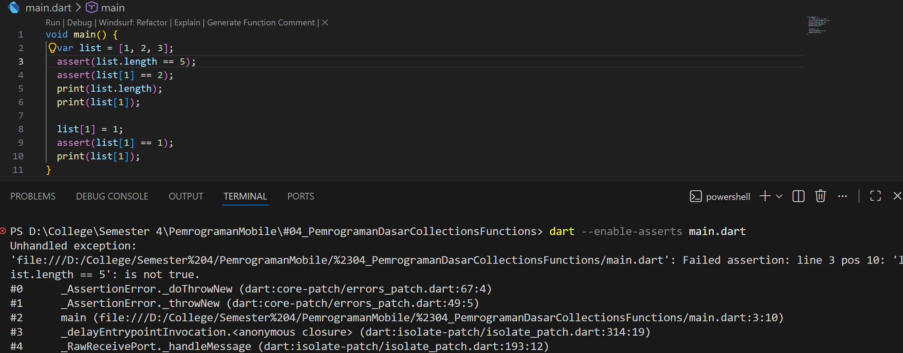


### Langkah 3:
Ubah kode pada langkah 1 menjadi variabel final yang mempunyai index = 5 dengan default value = null. Isilah nama dan NIM Anda pada elemen index ke-1 dan ke-2. Lalu print dan capture hasilnya.

Apa yang terjadi ? Jika terjadi error, silakan perbaiki.

**Jawab:**

Kode diubah menjadi seperti di bawah ini:

```dart
void main() {
  final list = List.filled(5, null);
  assert(list.length == 3);
  assert(list[1] == 2);
  print(list.length);
  print(list[1]);

  list[1] = 'Naswanida Nafiula';
  list[2] = '244107060063';
  assert(list[1] == 1);
  print(list[1]);
}
```

Hasilnya:
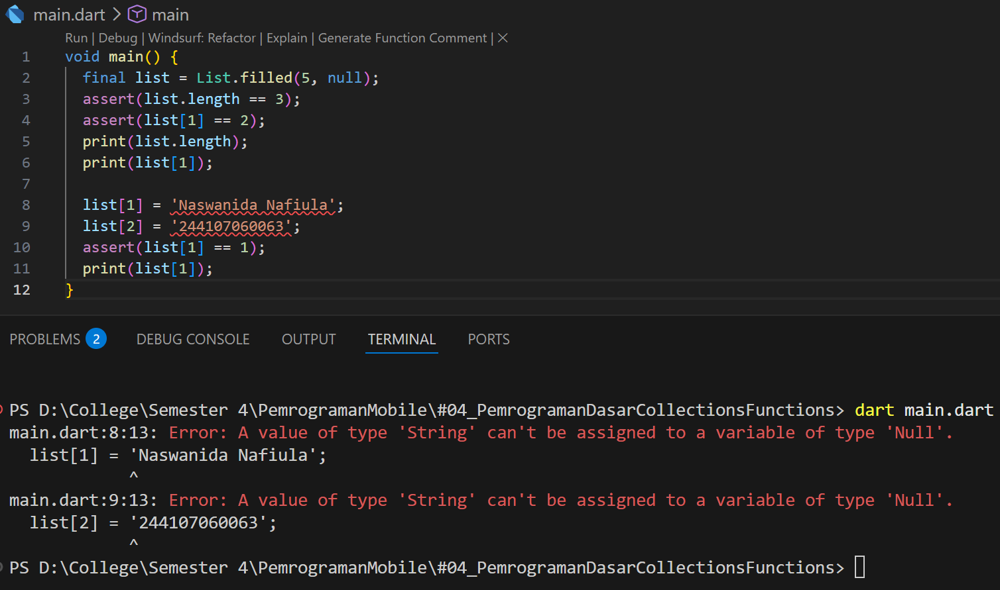
Terjadi error `A value of type 'String' can't be assigned to a variable of type 'Null'` pada baris 8 dan 9. Hal ini terjadi karena `List.filled(5, null)` membuat list dengan tipe `List<Null>`, sehingga semua elemennya hanya bisa berisi `null`. Ketika mencoba mengisi index ke-1 dan ke-2 dengan nilai `String` berupa nama dan NIM, program langsung error karena tipe data tidak sesuai.

Berikut kode yang diperbaiki:

```dart
void main() {
  final list = List<dynamic>.filled(5, null);
  assert(list.length == 5);
  assert(list[1] == null);
  print(list.length);
  print(list[1]);

  list[1] = 'Naswanida Nafiula';
  list[2] = '244107060063';
  assert(list[1] == 'Naswanida Nafiula');
  assert(list[2] == '244107060063');
  print(list[1]);
  print(list[2]);
}
```

Outputnya setelah diperbaiki:
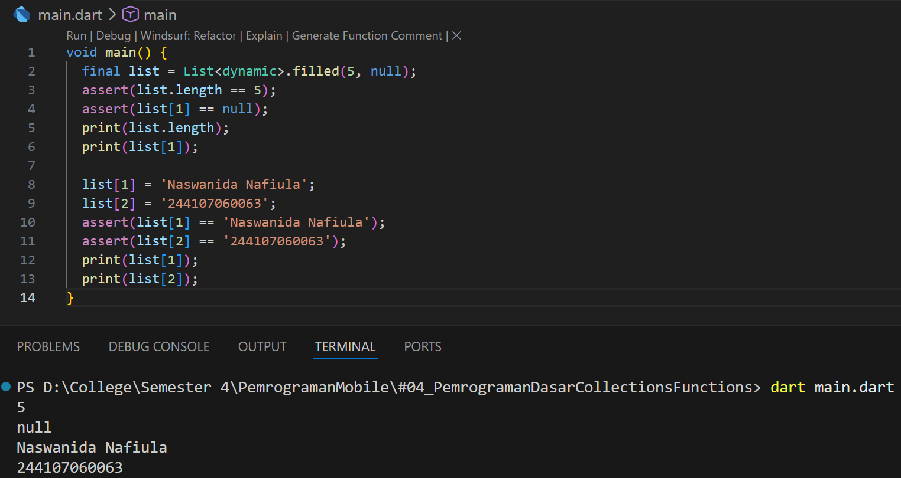
Program berhasil dijalankan setelah tipe list diubah menjadi `List<dynamic>` sehingga bisa menampung berbagai tipe data. Output `5` berasal dari `list.length` yang menunjukkan jumlah elemen list, `null` merupakan nilai awal index ke-1 sebelum diisi, kemudian `Naswanida Nafiula` dan `244107060063` muncul setelah index ke-1 dan ke-2 berhasil diisi dengan nama dan NIM.

---

## Praktikum 2: Eksperimen Tipe Data Set
### Langkah 1:
Ketik atau salin kode program berikut ke dalam fungsi `main()`.

```dart
void main() {
  var halogens = {'fluorine', 'chlorine', 'bromine', 'iodine', 'astatine'};
  print(halogens);
}
```
### Langkah 2:
Silakan coba eksekusi (Run) kode pada langkah 1 tersebut. Apa yang terjadi? Jelaskan! Lalu perbaiki jika terjadi error.

**Jawab:**

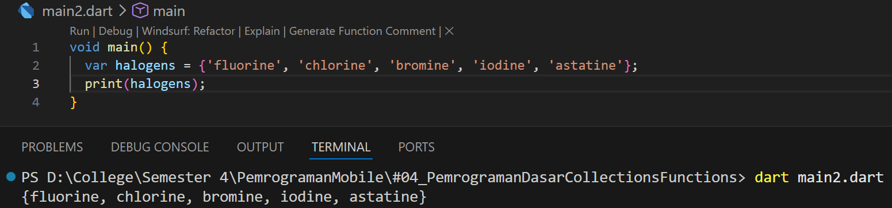
Program berhasil dijalankan tanpa error dan menghasilkan output `{fluorine, chlorine, bromine, iodine, astatine}`. Variabel `halogens` dideklarasikan menggunakan `var` dengan isi berupa kumpulan `String`, sehingga Dart menginfer tipenya sebagai `Set<String>`. Berbeda dengan `List` yang menggunakan kurung siku `[]`, `Set` menggunakan kurung kurawal `{}` dan tidak memperbolehkan elemen duplikat.

### Langkah 3:
Tambahkan kode program berikut, lalu coba eksekusi (Run) kode Anda.

```dart
var names1 = <String>{};
Set<String> names2 = {}; // This works, too.
var names3 = {}; // Creates a map, not a set.

print(names1);
print(names2);
print(names3);
```

Apa yang terjadi ? Jika terjadi error, silakan perbaiki namun tetap menggunakan ketiga variabel tersebut. Tambahkan elemen nama dan NIM Anda pada kedua variabel Set tersebut dengan dua fungsi berbeda yaitu `.add()` dan `.addAll()`. Untuk variabel Map dihapus, nanti kita coba di praktikum selanjutnya.

**Jawab:**

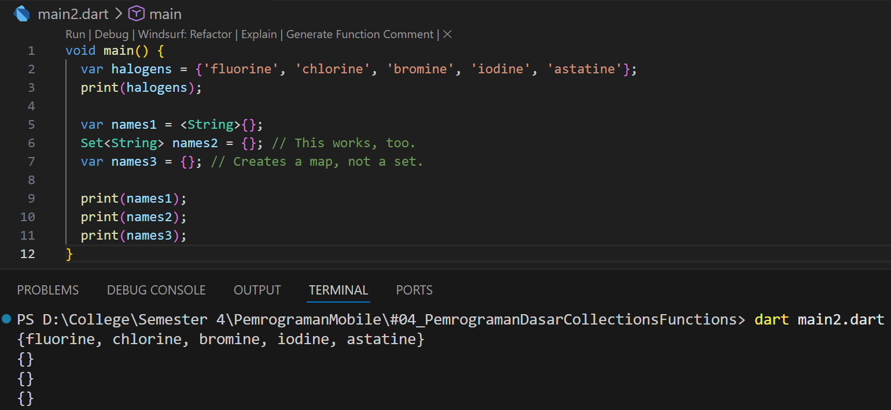
Program berhasil dijalankan tanpa error dan menghasilkan output `{}` untuk ketiga variabel karena semuanya dideklarasikan sebagai kosong. `names1` dan `names2` keduanya merupakan `Set<String>` yang dideklarasikan dengan cara berbeda namun menghasilkan tipe yang sama, sedangkan `names3` yang dideklarasikan dengan `var names3 = {}` diinfer sebagai `Map` bukan `Set` karena tidak ada tipe yang ditentukan secara eksplisit.

Berikut kode yang ditambahkan elemen nama dan nim pada kedua variabel Set:

```dart
void main() {
  var halogens = {'fluorine', 'chlorine', 'bromine', 'iodine', 'astatine'};
  print(halogens);

  var names1 = <String>{};
  Set<String> names2 = {};
  var names3 = {};

  names1.add('Naswanida Nafiula');
  names1.add('244107060063');

  names2.addAll({'Naswanida Nafiula', '244107060063'});

  print(names1);
  print(names2);
  print(names3);
}
```

Outputnya setelah ditambahkan:
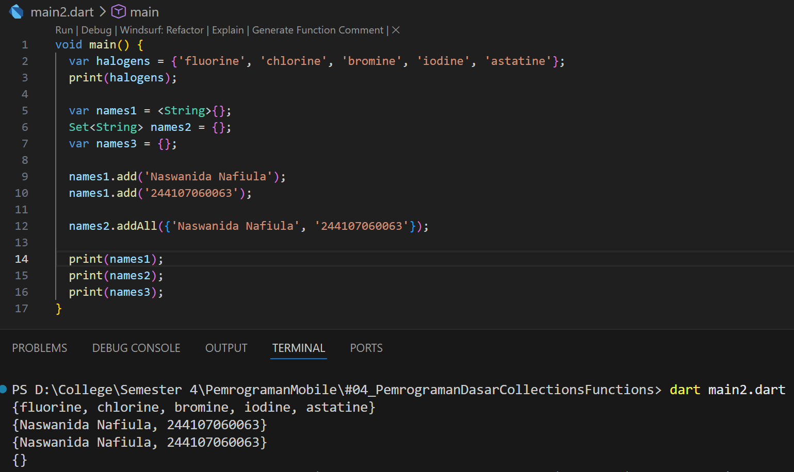
Setelah ditambahkan nama dan NIM menggunakan dua fungsi berbeda, `names1` menggunakan `.add()` yang menambahkan elemen satu per satu, sedangkan `names2` menggunakan `.addAll()` yang menambahkan beberapa elemen sekaligus. Keduanya menghasilkan output yang sama yaitu `{Naswanida Nafiula, 244107060063}` karena keduanya bertipe `Set<String>`. Sementara `names3` tetap menampilkan `{}` karena bertipe `Map` sehingga tidak bisa ditambahkan elemen menggunakan `.add()` maupun `.addAll()` dan dibiarkan kosong karena untuk praktikum selanjutnya.

---

## Praktikum 3: Eksperimen Tipe Data Maps
### Langkah 1:
Ketik atau salin kode program berikut ke dalam fungsi `main()`.

```dart
void main() {
  var gifts = {
    // Key:    Value
    'first': 'partridge',
    'second': 'turtledoves',
    'fifth': 1,
  };

  var nobleGases = {2: 'helium', 10: 'neon', 18: 2};

  print(gifts);
  print(nobleGases);
}
```
### Langkah 2:
Silakan coba eksekusi (Run) kode pada langkah 1 tersebut. Apa yang terjadi? Jelaskan! Lalu perbaiki jika terjadi error.

**Jawab:**

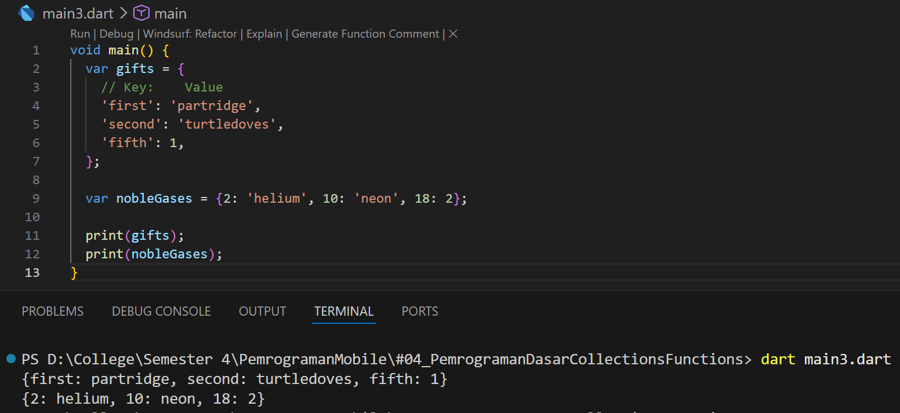
Program berhasil dijalankan tanpa error sehingga tidak perlu dilakukan perbaikan. Output yang dihasilkan adalah `{first: partridge, second: turtledoves, fifth: 1}` dari variabel `gifts` dan `{2: helium, 10: neon, 18: 2}` dari variabel `nobleGases`. Keduanya merupakan tipe data `Map` yang menyimpan data dalam format key-value, dimana `gifts` menggunakan `String` sebagai key dan `nobleGases` menggunakan `int` sebagai key.

### Langkah 3:
Tambahkan kode program berikut, lalu coba eksekusi (Run) kode Anda.

```dart
var mhs1 = Map<String, String>();
gifts['first'] = 'partridge';
gifts['second'] = 'turtledoves';
gifts['fifth'] = 'golden rings';

var mhs2 = Map<int, String>();
nobleGases[2] = 'helium';
nobleGases[10] = 'neon';
nobleGases[18] = 'argon';
```

Apa yang terjadi ? Jika terjadi error, silakan perbaiki.
Tambahkan elemen nama dan NIM Anda pada tiap variabel di atas (`gifts`, `nobleGases`, `mhs1`, dan `mhs2`).

**Jawab:**

```dart
void main() {
  var gifts = {
    // Key:    Value
    'first': 'partridge',
    'second': 'turtledoves',
    'fifth': 1,
  };

  var nobleGases = {2: 'helium', 10: 'neon', 18: 2};

  print(gifts);
  print(nobleGases);

  var mhs1 = Map<String, String>();
  gifts['first'] = 'partridge';
  gifts['second'] = 'turtledoves';
  gifts['fifth'] = 'golden rings';

  var mhs2 = Map<int, String>();
  nobleGases[2] = 'helium';
  nobleGases[10] = 'neon';
  nobleGases[18] = 'argon';
}
```

Outputnya :
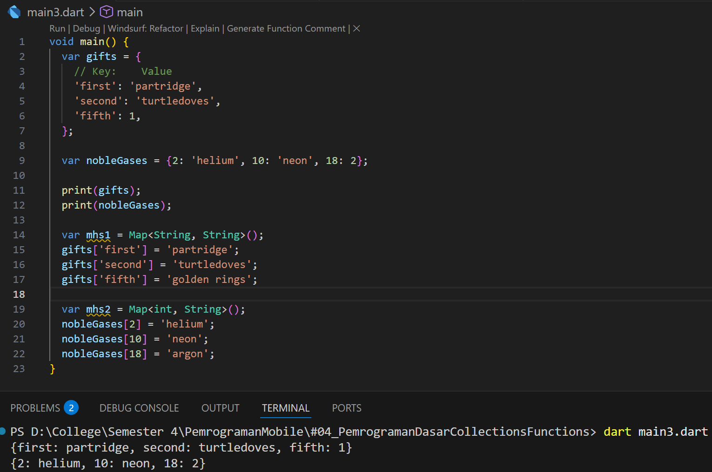
Program berhasil dijalankan tanpa error dan menghasilkan output `{first: partridge, second: turtledoves, fifth: 1}` dan `{2: helium, 10: neon, 18: 2}`. Karena `print` diletakkan sebelum assignment dilakukan, sehingga yang tercetak masih nilai awal. Selain itu, terdapat warning `The value of the local variable 'mhs1' isn't used` dan `'mhs2' isn't used` karena kedua variabel tersebut dideklarasikan namun tidak pernah digunakan atau diprint di manapun dalam program.

Berikut ketika `print` diletakkan setelah semua assignment:

```dart
void main() {
  var gifts = {
    // Key:    Value
    'first': 'partridge',
    'second': 'turtledoves',
    'fifth': 1,
  };

  var nobleGases = {2: 'helium', 10: 'neon', 18: 2};

  var mhs1 = Map<String, String>();
  gifts['first'] = 'partridge';
  gifts['second'] = 'turtledoves';
  gifts['fifth'] = 'golden rings';

  var mhs2 = Map<int, String>();
  nobleGases[2] = 'helium';
  nobleGases[10] = 'neon';
  nobleGases[18] = 'argon';

  print(gifts);
  print(nobleGases);
}
```

Outputnya :
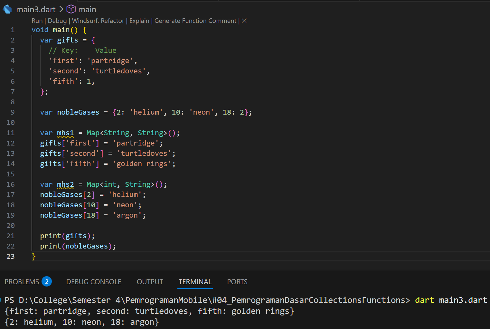
Setelah `print` dipindah ke setelah semua assignment, output yang dihasilkan berubah menjadi `{first: partridge, second: turtledoves, fifth: golden rings}` dan `{2: helium, 10: neon, 18: argon}` karena nilai `gifts['fifth']` sudah diubah dari `1` menjadi `'golden rings'` dan `nobleGases[18]` sudah diubah dari `2` menjadi `'argon'` sebelum diprint. Warning `mhs1` dan `mhs2` masih muncul karena kedua variabel tersebut tetap tidak diprint.

Berikut kode yang ditambahkan elemen nama dan nim pada kedua variabel Set dan perbaikan:

```dart
void main() {
  var gifts = {
    // Key:    Value
    'first': 'partridge',
    'second': 'turtledoves',
    'fifth': 1,
  };

  var nobleGases = {2: 'helium', 10: 'neon', 18: 2};

  var mhs1 = Map<String, String>();
  gifts['first'] = 'partridge';
  gifts['second'] = 'turtledoves';
  gifts['fifth'] = 'golden rings';
  gifts['nama'] = 'Naswanida Nafiula';
  gifts['nim'] = '244107060063';

  var mhs2 = Map<int, String>();
  nobleGases[2] = 'helium';
  nobleGases[10] = 'neon';
  nobleGases[18] = 'argon';
  nobleGases[19] = 'Naswanida Nafiula';
  nobleGases[20] = '244107060063';

  mhs1['nama'] = 'Naswanida Nafiula';
  mhs1['nim'] = '244107060063';

  mhs2[1] = 'Naswanida Nafiula';
  mhs2[2] = '244107060063';

  print(gifts);
  print(nobleGases);
  print(mhs1);
  print(mhs2);
}
```

Outputnya setelah ditambahkan dan diperbaiki:
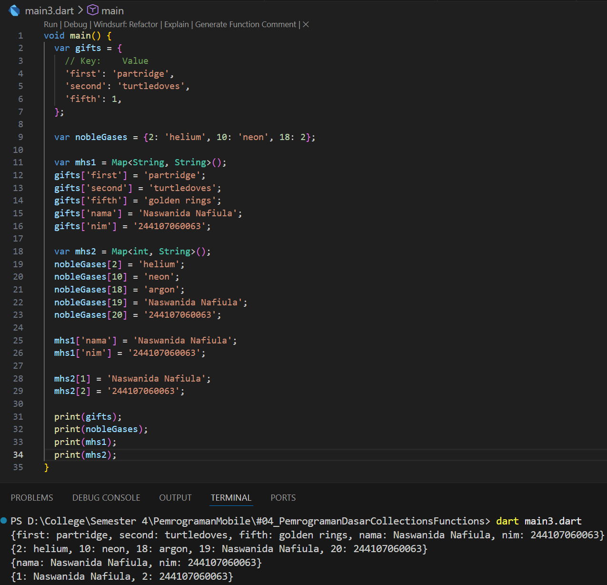
Program berhasil dijalankan dan menampilkan keempat variabel. `gifts` menampilkan data map dengan key `String` yang sudah diupdate termasuk nama dan NIM. `nobleGases` menampilkan data map dengan key `int` yang sudah diupdate dengan key `19` dan `20` berisi nama dan NIM. `mhs1` merupakan `Map<String, String>` yang diisi nama dan NIM menggunakan key `'nama'` dan `'nim'`. `mhs2` merupakan `Map<int, String>` yang diisi nama dan NIM menggunakan key `1` dan `2`.

---

## Praktikum 4: Eksperimen Tipe Data List: Spread dan Control-flow Operators
### Langkah 1:
Ketik atau salin kode program berikut ke dalam fungsi `main()`.

```dart
void main() {
  var list = [1, 2, 3];
  var list2 = [0, ...list];
  print(list1);
  print(list2);
  print(list2.length);
}
```
### Langkah 2:
Silakan coba eksekusi (Run) kode pada langkah 1 tersebut. Apa yang terjadi? Jelaskan! Lalu perbaiki jika terjadi error.

**Jawab:**

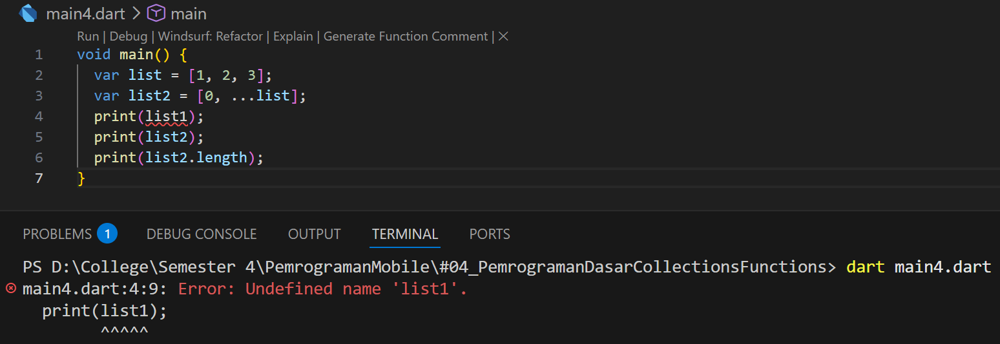
Terjadi error `Undefined name 'list1'` karena variabel yang dideklarasikan bernama `list` bukan `list1`, sehingga `print(list1)` tidak dapat menemukan variabel tersebut. Dart bersifat case-sensitive dan tidak mengenali variabel yang belum dideklarasikan, sehingga program gagal dijalankan.

Berikut kode yang diperbaiki:

```dart
void main() {
  var list = [1, 2, 3];
  var list2 = [0, ...list];
  print(list);
  print(list2);
  print(list2.length);
}
```

Outputnya setelah diperbaiki:
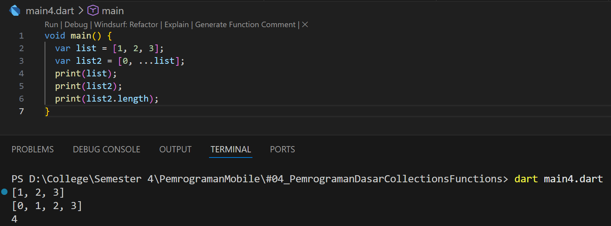
Setelah diperbaiki dengan mengubah `list1` menjadi `list`, program berhasil dijalankan tanpa error. Output `[1, 2, 3]` merupakan isi dari variabel `list`, kemudian `[0, 1, 2, 3]` merupakan isi dari `list2` yang dibuat menggunakan spread operator `...list` sehingga seluruh elemen `list` disalin ke dalam `list2` dengan tambahan angka `0` di depan. Output `4` merupakan panjang dari `list2` yang memiliki 4 elemen.

### Langkah 3:
Tambahkan kode program berikut, lalu coba eksekusi (Run) kode Anda.

```dart
list1 = [1, 2, null];
print(list1);
var list3 = [0, ...?list1];
print(list3.length);
```

Apa yang terjadi ? Jika terjadi error, silakan perbaiki.
Tambahkan variabel list berisi NIM Anda menggunakan Spread Operators. 

**Jawab:**

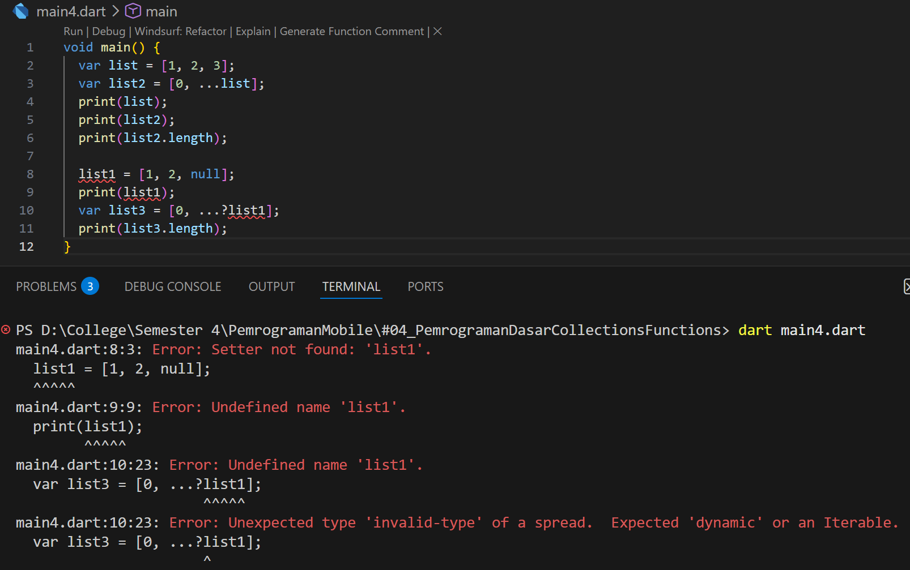
Terjadi beberapa error karena `list1` tidak dideklarasikan menggunakan `var` sehingga Dart tidak mengenalinya sebagai variabel baru dan memunculkan error `Setter not found: 'list1'` dan `Undefined name 'list1'`. Akibatnya, `list3` yang menggunakan spread operator `...?list1` juga error karena `list1` tidak dikenali, sehingga muncul error `Unexpected type 'invalid-type' of a spread. Expected 'dynamic' or an Iterable`.

Berikut kode yang diperbaiki:

```dart
void main() {
  var list = [1, 2, 3];
  var list2 = [0, ...list];
  print(list);
  print(list2);
  print(list2.length);

  var list1 = [1, 2, null];
  print(list1);
  var list3 = [0, ...?list1];
  print(list3.length);
}
```

Outputnya setelah diperbaiki:
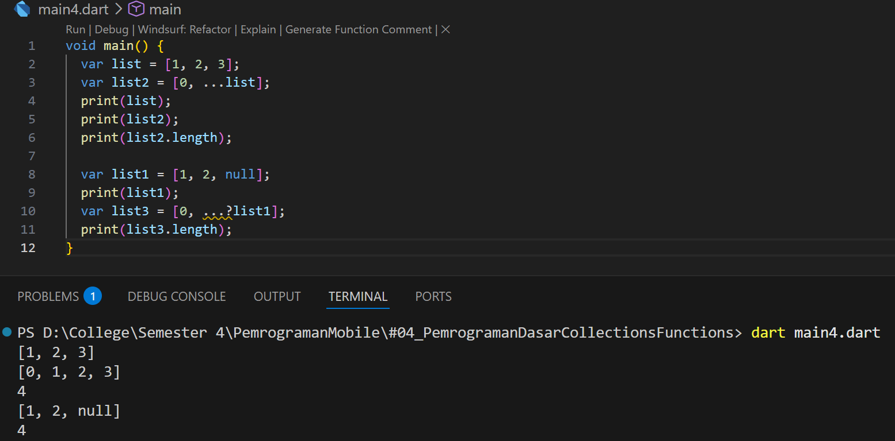

Tetapi terdapat warning seperti berikut:
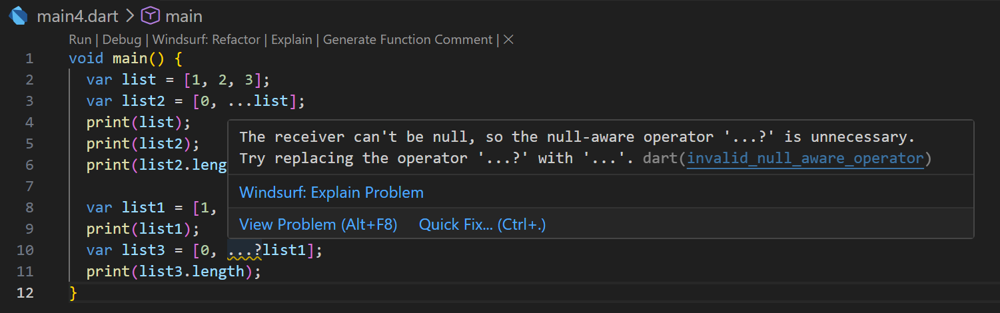
Setelah diperbaiki dengan menambahkan `var` sebelum `list1`, program berhasil dijalankan dan menghasilkan output `[1, 2, 3]`, `[0, 1, 2, 3]`, `4`, `[1, 2, null]`, dan `4`. `list3` menggunakan null-aware spread operator `...?` yang berfungsi untuk mengabaikan list jika nilainya `null`. Output `4` pada `list3` karena elemen `null` dalam `list1` tetap dihitung sebagai elemen sehingga total elemen menjadi 4. Namun terdapat warning `The receiver can't be null, so the null-aware operator '...?' is unnecessary` karena `list1` sudah pasti tidak `null`, sehingga penggunaan `...?` tidak diperlukan dan disarankan diganti dengan `...` biasa.

Berikut kode supaya tidak muncul warning:
```dart
void main() {
  var list = [1, 2, 3];
  var list2 = [0, ...list];
  print(list);
  print(list2);
  print(list2.length);

  var list1 = [1, 2, null];
  print(list1);
  var list3 = [0, ...list1];
  print(list3.length);
}
```

Outputnya supaya tidak muncul warning:
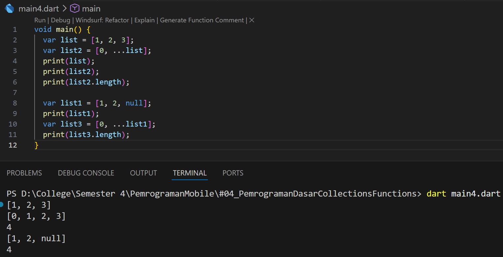
Setelah `...?list1` diganti menjadi `...list1`, warning hilang dan program berjalan normal tanpa error maupun warning. Output yang dihasilkan tetap sama yaitu `[1, 2, 3]`, `[0, 1, 2, 3]`, `4`, `[1, 2, null]`, dan `4` karena `null` dalam `list1` tetap dihitung sebagai elemen sehingga panjang `list3` tetap 4.

Berikut kode yang ditambahkan variabel list berisi NIM menggunakan Spread Operators:

```dart
void main() {
  var list = [1, 2, 3];
  var list2 = [0, ...list];
  print(list);
  print(list2);
  print(list2.length);

  var list1 = [1, 2, null];
  print(list1);
  var list3 = [0, ...list1];
  print(list3.length);

  var nim = ['244107060063'];
  var listNim = [0, ...nim];
  print(listNim);
}
```

Outputnya setelah ditambahkan:
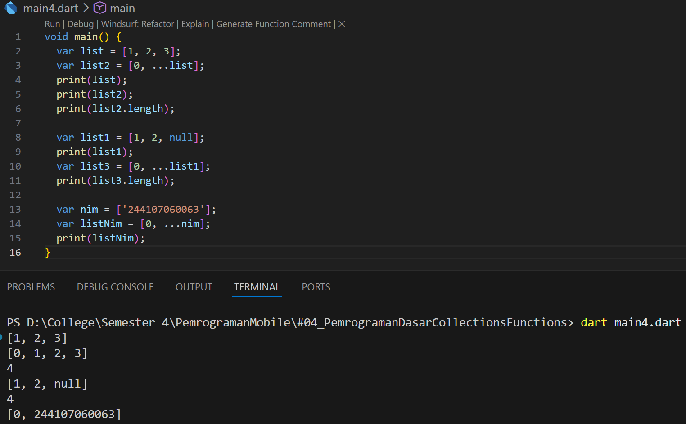
Variabel `nim` berisi NIM dalam bentuk list dengan satu elemen `String`, kemudian disebarkan ke `listNim` menggunakan spread operator `...nim` dengan tambahan angka `0` di depan. Output `[0, 244107060063]` menunjukkan bahwa elemen dari `nim` berhasil disalin ke `listNim` menggunakan spread operator.

### Langkah 4:
Tambahkan kode program berikut, lalu coba eksekusi (Run) kode Anda.

```dart
var nav = ['Home', 'Furniture', 'Plants', if (promoActive) 'Outlet'];
print(nav);
```

Apa yang terjadi ? Jika terjadi error, silakan perbaiki. Tunjukkan hasilnya jika variabel `promoActive` ketika `true` dan `false`.

**Jawab:**

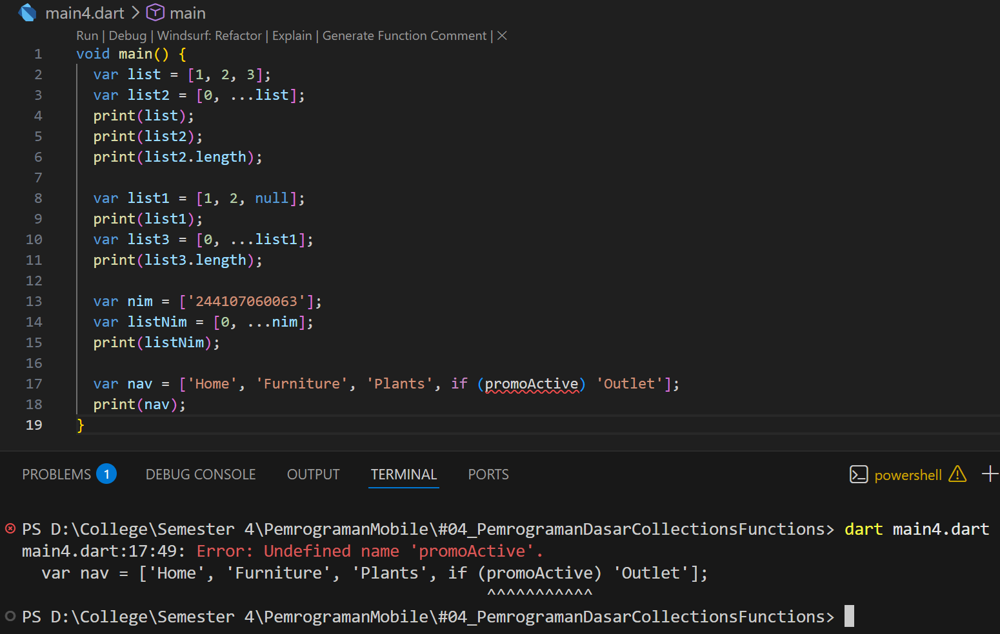
Terjadi error `Undefined name 'promoActive'` karena variabel `promoActive` digunakan dalam kondisi `if` di dalam list namun belum dideklarasikan sebelumnya, sehingga Dart tidak mengenalinya dan program gagal dijalankan.

Berikut kode yang diperbaiki:

```dart
void main() {
  var list = [1, 2, 3];
  var list2 = [0, ...list];
  print(list);
  print(list2);
  print(list2.length);

  var list1 = [1, 2, null];
  print(list1);
  var list3 = [0, ...list1];
  print(list3.length);

  var nim = ['244107060063'];
  var listNim = [0, ...nim];
  print(listNim);

  bool promoActive = true;
  var nav = ['Home', 'Furniture', 'Plants', if (promoActive) 'Outlet'];
  print(nav);

  promoActive = false;
  nav = ['Home', 'Furniture', 'Plants', if (promoActive) 'Outlet'];
  print(nav);
}
```

Outputnya setelah diperbaiki:
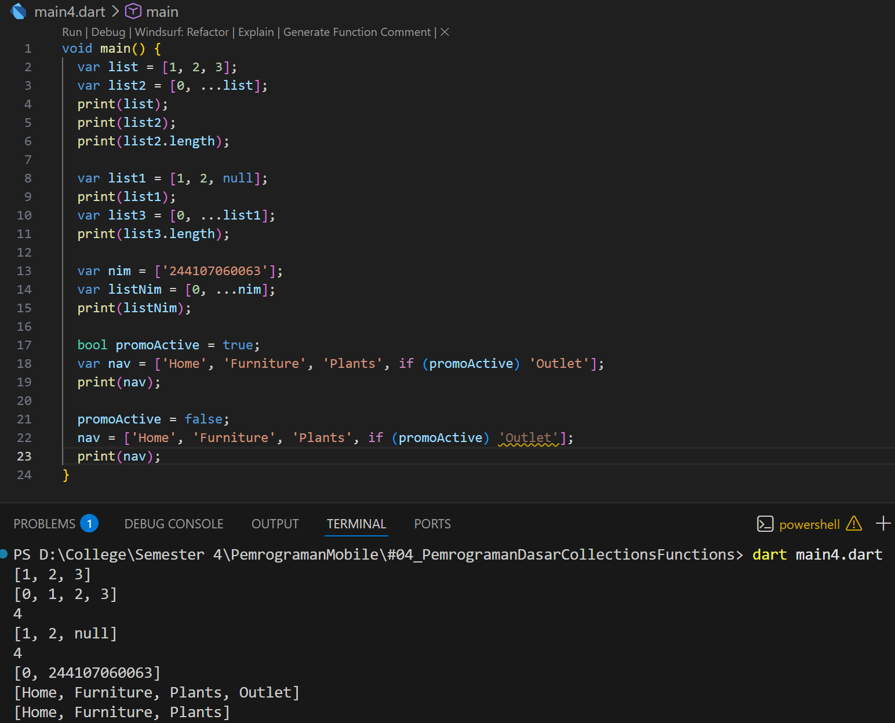
Setelah `promoActive` dideklarasikan, program berhasil dijalankan. Ketika `promoActive = true`, output `nav` adalah `[Home, Furniture, Plants, Outlet]` karena kondisi `if (promoActive)` terpenuhi sehingga elemen `'Outlet'` ikut ditambahkan ke dalam list. Ketika `promoActive = false`, output `nav` adalah `[Home, Furniture, Plants]` tanpa `'Outlet'` karena kondisi `if` tidak terpenuhi sehingga elemen tersebut tidak ditambahkan. Terdapat warning pada baris 22 karena `'Outlet'` tidak akan pernah ditambahkan saat `promoActive` bernilai `false`.

### Langkah 5:
Tambahkan kode program berikut, lalu coba eksekusi (Run) kode Anda.

```dart
var nav2 = ['Home', 'Furniture', 'Plants', if (login case 'Manager') 'Inventory'];
print(nav2);
```

Apa yang terjadi ? Jika terjadi error, silakan perbaiki. Tunjukkan hasilnya jika variabel `login` mempunyai kondisi lain.

**Jawab:**

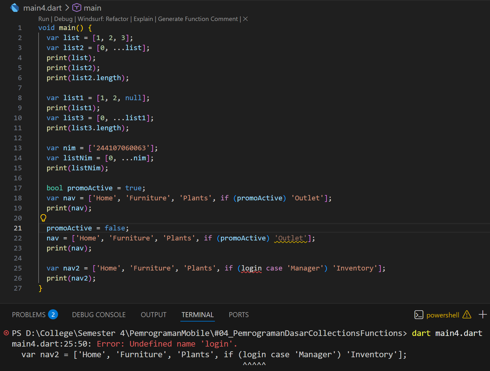
Terjadi error `Undefined name 'login'` karena variabel `login` digunakan dalam kondisi `if` di dalam list namun belum dideklarasikan sebelumnya, sehingga Dart tidak mengenalinya dan program gagal dijalankan.

Berikut kode yang diperbaiki:

```dart
void main() {
  var list = [1, 2, 3];
  var list2 = [0, ...list];
  print(list);
  print(list2);
  print(list2.length);

  var list1 = [1, 2, null];
  print(list1);
  var list3 = [0, ...list1];
  print(list3.length);

  var nim = ['244107060063'];
  var listNim = [0, ...nim];
  print(listNim);

  bool promoActive = true;
  var nav = ['Home', 'Furniture', 'Plants', if (promoActive) 'Outlet'];
  print(nav);

  promoActive = false;
  nav = ['Home', 'Furniture', 'Plants', if (promoActive) 'Outlet'];
  print(nav);

  String login = 'Manager';
  var nav2 = ['Home', 'Furniture', 'Plants', if (login case 'Manager') 'Inventory'];
  print(nav2);

  login = 'User';
  nav2 = ['Home', 'Furniture', 'Plants', if (login case 'Manager') 'Inventory'];
  print(nav2);
}
```

Outputnya setelah diperbaiki:
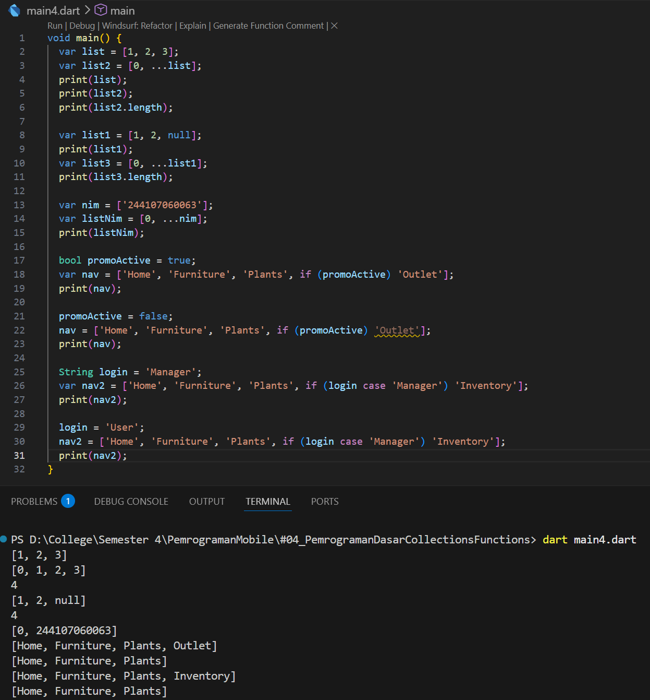
Setelah `login` dideklarasikan sebagai `String`, program berhasil dijalankan. Ketika `login = 'Manager'`, output `nav2` adalah `[Home, Furniture, Plants, Inventory]` karena kondisi `if (login case 'Manager')` terpenuhi sehingga elemen `'Inventory'` ditambahkan. Ketika `login = 'User'`, output `nav2` adalah `[Home, Furniture, Plants]` tanpa `'Inventory'` karena kondisi tidak terpenuhi. Dart mendukung penggunaan `if-case` langsung di dalam list, sehingga elemen bisa ditambahkan secara kondisional berdasarkan nilai variabel tanpa perlu menulis logika tambahan di luar list.

### Langkah 6:
Tambahkan kode program berikut, lalu coba eksekusi (Run) kode Anda.

```dart
var listOfInts = [1, 2, 3];
var listOfStrings = ['#0', for (var i in listOfInts) '#$i'];
assert(listOfStrings[1] == '#1');
print(listOfStrings);
```

Apa yang terjadi ? Jika terjadi error, silakan perbaiki. Jelaskan manfaat Collection For dan dokumentasikan hasilnya.

**Jawab:**

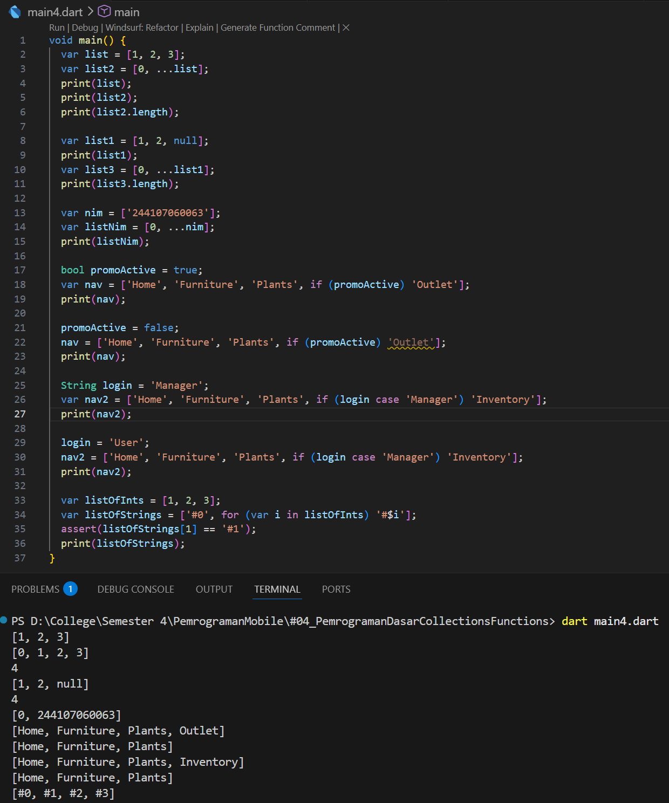
Program berhasil dijalankan tanpa error dan menghasilkan output `[#0, #1, #2, #3]` dari `listOfStrings`. Collection For mengiterasi setiap elemen dalam `listOfInts` yaitu `1`, `2`, `3` dan mengubahnya menjadi string `'#1'`, `'#2'`, `'#3'`, lalu digabungkan dengan elemen awal `'#0'`. 

Manfaat Collection For adalah memungkinkan pembuatan list baru secara dinamis dari list lain langsung di dalam deklarasi list tanpa perlu membuat loop terpisah, sehingga kode lebih ringkas dan mudah dibaca.

---

## Praktikum 5: Eksperimen Tipe Data Records
### Langkah 1:
Ketik atau salin kode program berikut ke dalam fungsi `main()`.

```dart
void main () {
  var record = ('first', a: 2, b: true, 'last');
  print(record)
}
```

### Langkah 2:
Silakan coba eksekusi (Run) kode pada langkah 1 tersebut. Apa yang terjadi? Jelaskan! Lalu perbaiki jika terjadi error.

**Jawab:**

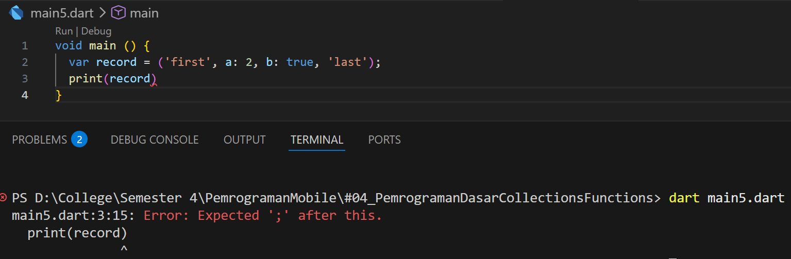
Terjadi error `Expected ';' after this` karena `print(record)` tidak diakhiri dengan tanda titik koma `;`. Dart mengharuskan setiap pernyataan diakhiri dengan `;`, sehingga program gagal dijalankan.

Berikut kode yang diperbaiki:

```dart
void main () {
  var record = ('first', a: 2, b: true, 'last');
  print(record);
}
```

Outputnya setelah diperbaiki:
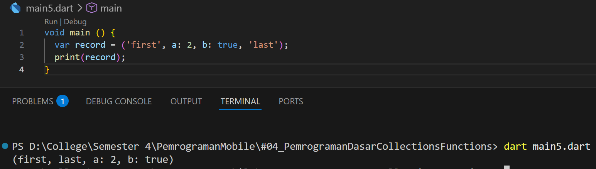
Setelah ditambahkan `;` pada `print(record)`, program berhasil dijalankan dan menghasilkan output `(first, last, a: 2, b: true)`. `record` merupakan tipe data Record di Dart yang bisa menyimpan berbagai tipe data sekaligus, baik positional maupun named. Positional fields (`'first'` dan `'last'`) ditampilkan lebih dulu, diikuti named fields (`a: 2` dan `b: true`).

### Langkah 3:
Tambahkan kode program berikut di luar scope `void main()`, lalu coba eksekusi (Run) kode Anda.

```dart
(int, int) tukar((int, int) record) {
  var (a, b) = record;
  return (b, a);
}
```

Apa yang terjadi ? Jika terjadi error, silakan perbaiki. Gunakan fungsi `tukar()` di dalam `main()` sehingga tampak jelas proses pertukaran value field di dalam Records.

**Jawab:**

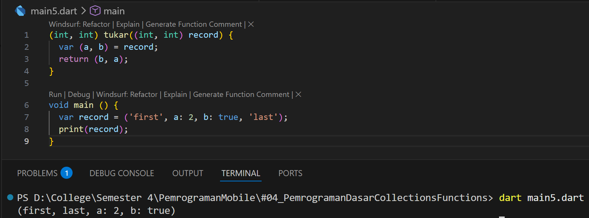
Program berhasil dijalankan dan menghasilkan output `(first, last, a: 2, b: true)`. Namun fungsi `tukar()` belum dipanggil di dalam `main()`, sehingga fungsi tersebut tidak memberikan efek apapun pada output dan proses pertukaran value field belum terlihat.

Berikut kode yang diperbaiki:

```dart
(int, int) tukar((int, int) record) {
  var (a, b) = record;
  return (b, a);
}

void main() {
  var record = ('first', a: 2, b: true, 'last');
  print(record);

  var tukarRecord = tukar((4, 5));
  print(tukarRecord);
}
```

Outputnya setelah diperbaiki:
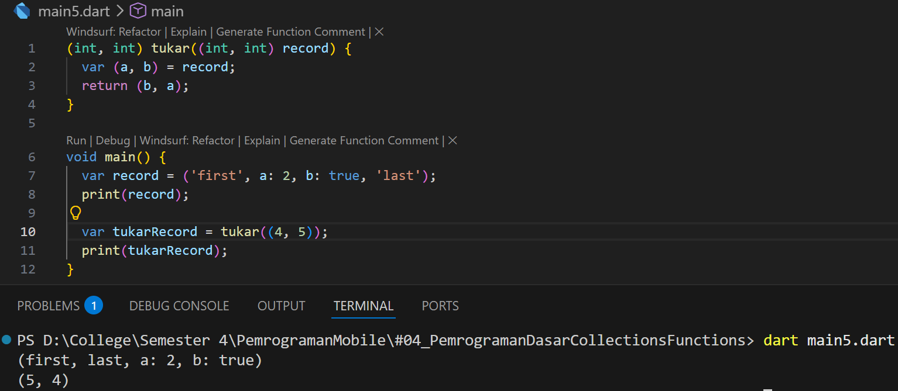
Program berhasil dijalankan dan menghasilkan dua output. Output pertama `(first, last, a: 2, b: true)` merupakan isi dari variabel `record`. Output kedua `(5, 4)` merupakan hasil pemanggilan fungsi `tukar((4, 5))` di mana fungsi tersebut menerima record bertipe `(int, int)` lalu menukar posisi dua nilai sehingga `(4, 5)` menjadi `(5, 4)`.

### Langkah 4:
Tambahkan kode program berikut di dalam scope `void main()`, lalu coba eksekusi (Run) kode Anda.

```dart
// Record type annotation in a variable declaration:
(String, int) mahasiswa;
print(mahasiswa);
```

Apa yang terjadi ? Jika terjadi error, silakan perbaiki. Inisialisasi field nama dan NIM Anda pada variabel record `mahasiswa` di atas.

**Jawab:**

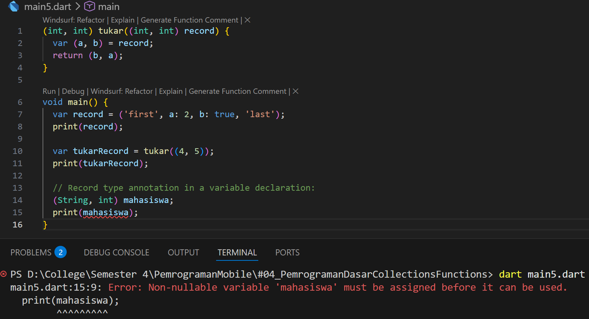
Terjadi error `Non-nullable variable 'mahasiswa' must be assigned before it can be used` karena variabel `mahasiswa` dideklarasikan dengan tipe `(String, int)` namun belum diisi nilai apapun sebelum digunakan di `print(mahasiswa)`. Dart tidak mengizinkan variabel non-nullable diakses sebelum diinisialisasi.

Berikut kode yang diperbaiki:

```dart
(int, int) tukar((int, int) record) {
  var (a, b) = record;
  return (b, a);
}

void main() {
  var record = ('first', a: 2, b: true, 'last');
  print(record);

  var tukarRecord = tukar((4, 5));
  print(tukarRecord);

  // Record type annotation in a variable declaration:
  (String, int) mahasiswa = ('Naswanida Nafiula', 244107060063);
  print(mahasiswa);
}
```

Outputnya setelah diperbaiki:
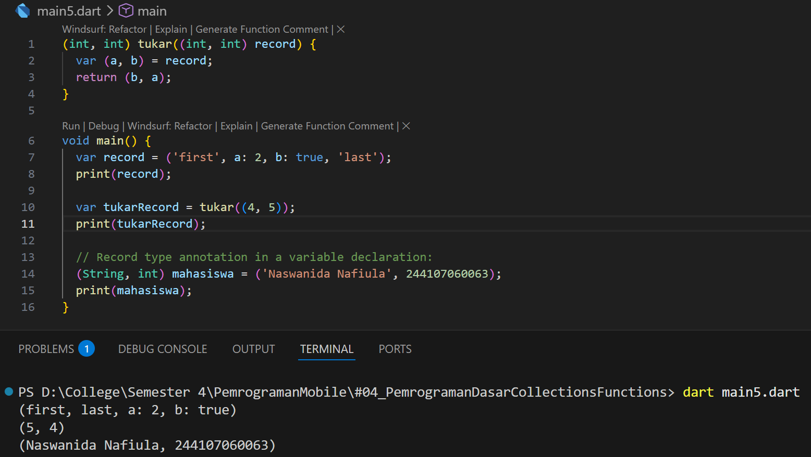
Variabel `mahasiswa` berhasil diinisialisasi dengan tipe record `(String, int)` dan diisi dengan nama `'Naswanida Nafiula'` dan NIM `244107060063`, sehingga menghasilkan output `(Naswanida Nafiula, 244107060063)`.

### Langkah 5:
Tambahkan kode program berikut di dalam scope `void main()`, lalu coba eksekusi (Run) kode Anda.

```dart
var mahasiswa2 = ('first', a: 2, b: true, 'last');

print(mahasiswa2.$1); // Prints 'first'
print(mahasiswa2.a); // Prints 2
print(mahasiswa2.b); // Prints true
print(mahasiswa2.$2); // Prints 'last'
```

Apa yang terjadi ? Jika terjadi error, silakan perbaiki. Gantilah salah satu isi record dengan nama dan NIM Anda

**Jawab:**

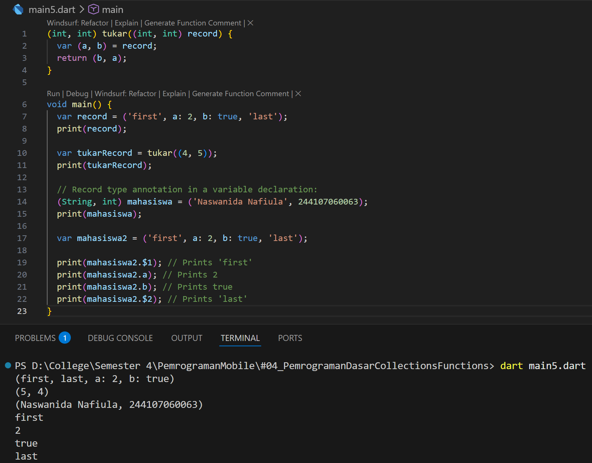
Program berhasil dijalankan tanpa error. Variabel `mahasiswa2` berisi record dengan dua positional fields dan dua named fields. `mahasiswa2.$1` mengakses positional field pertama sehingga menghasilkan `first`, `mahasiswa2.a` mengakses named field `a` sehingga menghasilkan `2`, `mahasiswa2.b` mengakses named field `b` sehingga menghasilkan `true`, dan `mahasiswa2.$2` mengakses positional field kedua sehingga menghasilkan `last`. Selanjutnya salah satu isi record perlu diganti dengan nama dan NIM.

Berikut kode yang diganti:

```dart
(int, int) tukar((int, int) record) {
  var (a, b) = record;
  return (b, a);
}

void main() {
  var record = ('first', a: 2, b: true, 'last');
  print(record);

  var tukarRecord = tukar((4, 5));
  print(tukarRecord);

  // Record type annotation in a variable declaration:
  (String, int) mahasiswa = ('Naswanida Nafiula', 244107060063);
  print(mahasiswa);

  var mahasiswa2 = ('Naswanida Nafiula', a: 2, b: true, '244107060063');

  print(mahasiswa2.$1); // Prints 'first'
  print(mahasiswa2.a); // Prints 2
  print(mahasiswa2.b); // Prints true
  print(mahasiswa2.$2); // Prints 'last'
}
```

Outputnya setelah diganti:
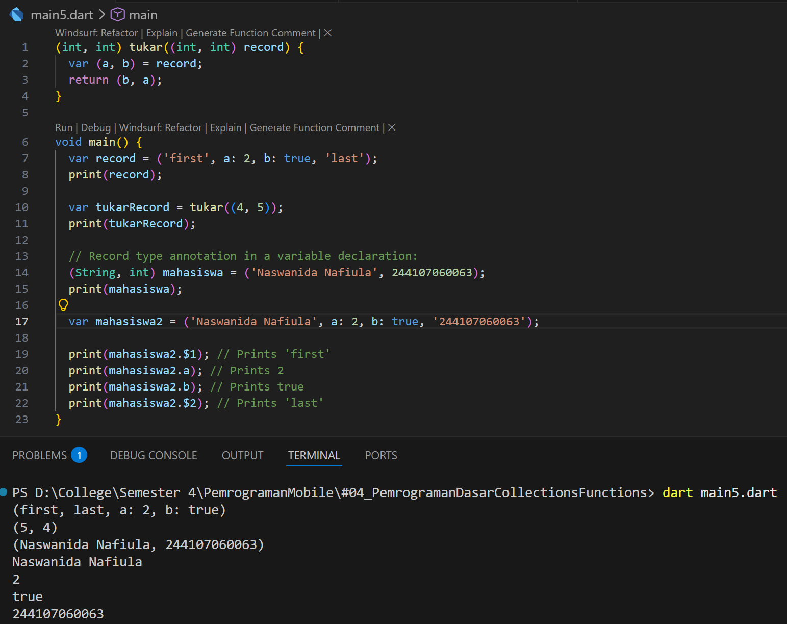
Program berhasil dijalankan tanpa error. `mahasiswa2.$1` mengakses positional field pertama yang sudah diganti dengan nama sehingga menghasilkan `Naswanida Nafiula`, `mahasiswa2.a` mengakses named field `a` yang tetap bernilai `2`, `mahasiswa2.b` mengakses named field `b` yang tetap bernilai `true`, dan `mahasiswa2.$2` mengakses positional field kedua yang sudah diganti dengan NIM sehingga menghasilkan `244107060063`.

---

## Tugas Praktikum

### 2. Jelaskan yang dimaksud Functions dalam bahasa Dart!

**Jawab:**

Functions (fungsi) dalam bahasa Dart adalah blok kode terorganisir yang dirancang untuk melakukan tugas tertentu, bersifat reusable (dapat digunakan kembali), dan modular. Fungsi membantu mempermudah penulisan program, meningkatkan keterbacaan kode, serta dapat menerima input (parameter) dan mengembalikan nilai (return value).

**Contoh**
```dart
int tambah(int a, int b) {
  return a + b;
}

void main() {
  print(tambah(3, 4));
}
```

Outputnya:
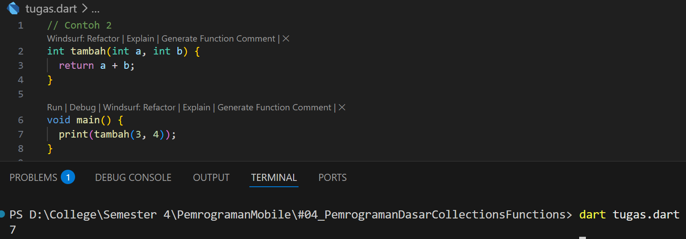

### 3. Jelaskan jenis-jenis parameter di Functions beserta contoh sintaksnya!

**Jawab:**

Jenis-jenis parameter di dart:

**a. Required Positional Parameters**

Parameter wajib yang harus diisi saat fungsi dipanggil dan urutannya harus sesuai posisi deklarasi. Jika tidak diisi maka program akan error.

**Contoh:**
```dart
void tampilMahasiswa(String nama, int nim) {
  print('Nama: $nama, NIM: $nim');
}

void main() {
  tampilMahasiswa('Naswanida Nafiula', 244107060063);
}
```

Outputnya:
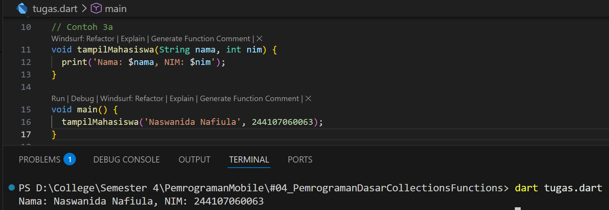

**b. Optional Positional Parameters**

Parameter opsional yang dibungkus dengan kurung siku `[]`, tidak wajib diisi saat pemanggilan fungsi. Jika tidak diisi, nilainya akan `null` kecuali diberi nilai default menggunakan `=`. Urutan pemanggilan tetap harus sesuai posisi.

**Contoh:**
```dart
void sapa(String nama, [String kota = 'Malang']) {
  print('Halo $nama, kamu dari $kota');
}

void main() {
  sapa('Naswa');
  sapa('Nida', 'Surabaya');
}
```

Outputnya:
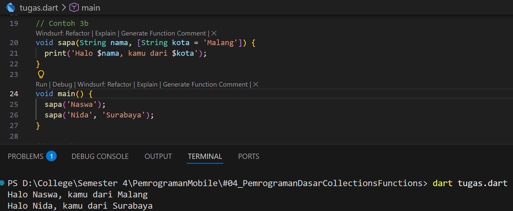

**c. Named Parameters**

Parameter opsional yang dideklarasikan menggunakan kurung kurawal `{}` dan dipanggil dengan menyebutkan nama parameternya. Nilainya `null` secara default jika tidak diisi dan tidak diberi nilai default. Untuk memberi nilai default gunakan `=`. Jika ingin mewajibkan parameter ini diisi, gunakan keyword `required`.

**Contoh:**
```dart
void cetakBiodata({String? nama, String? prodi}) {
  print('Nama: $nama, Prodi: $prodi');
}

void cetakAlamat({String nama = 'Naswanida Nafiula', String kota = 'Malang'}) {
  print('Nama: $nama, Kota: $kota');
}

void daftarKuliah({required String nama, required String matkul}) {
  print('$nama mendaftar matkul $matkul');
}

void main() {
  // Tanpa required
  cetakBiodata(nama: 'Naswanida Nafiula');

  // Dengan nilai default
  cetakAlamat();

  // Dengan required
  daftarKuliah(nama: 'Naswanida Nafiula', matkul: 'Pemrograman Mobile');
}
```

Outputnya:
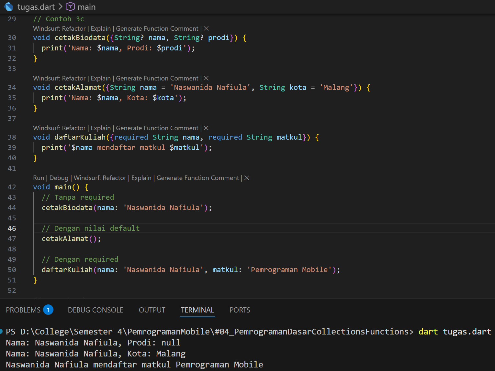

**d. Required Named Parameters**

Named parameter yang wajib diisi saat pemanggilan fungsi menggunakan keyword `required`. Jika tidak diisi maka analyzer akan melaporkan error.

**Contoh:**
```dart
void inputNilai({required String nama, required double nilai}) {
  print('Nama: $nama, Nilai: $nilai');
}

void main() {
  inputNilai(nama: 'Naswanida Nafiula', nilai: 95.0);
}
```

Outputnya:
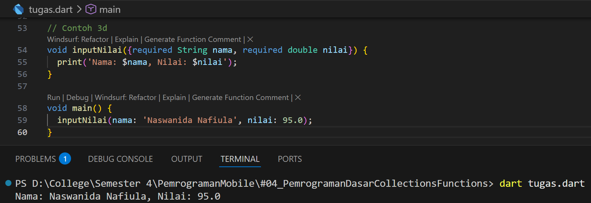

### 4. Jelaskan maksud Functions sebagai first-class objects beserta contoh sintaknya!

**Jawab:**

Functions sebagai first-class objects berarti functions di Dart diperlakukan seperti objek biasa. Functions bisa disimpan dalam variabel, dijadikan argumen saat memanggil fungsi lain, atau dikembalikan sebagai nilai dari fungsi lain.

**Contoh:**

**a. Disimpan dalam variabel:**
```dart
void tampilNama(String nama) {
  print('Nama: $nama');
}

void main() {
  var fungsi = tampilNama;
  fungsi('Naswanida Nafiula');
}
```

Outputnya:
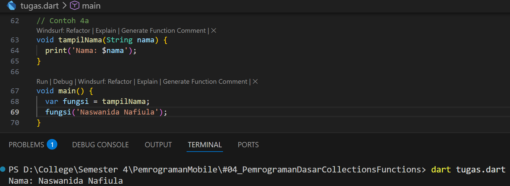

**b. Dijadikan argumen:**
```dart
void jalankan(String nama, void Function(String) aksi) {
  aksi(nama);
}

void sapa(String nama) {
  print('Halo, $nama!');
}

void main() {
  jalankan('Naswanida Nafiula', sapa);
}
```

Outputnya:
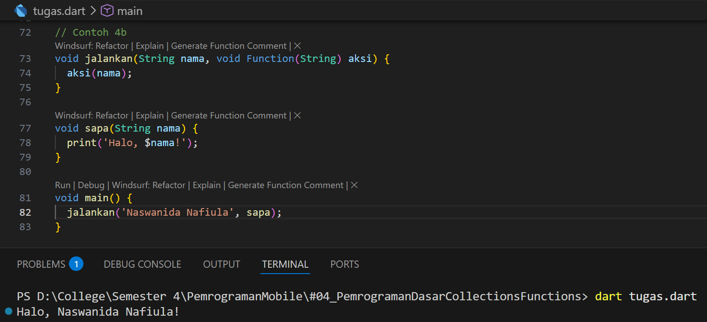

**c. Dikembalikan dari fungsi lain:**
```dart
Function salam(String sapaan) {
  return (String nama) => print('$sapaan, $nama!');
}

void main() {
  var pagi = salam('Selamat pagi');
  pagi('Naswanida Nafiula');
}
```

Outputnya:
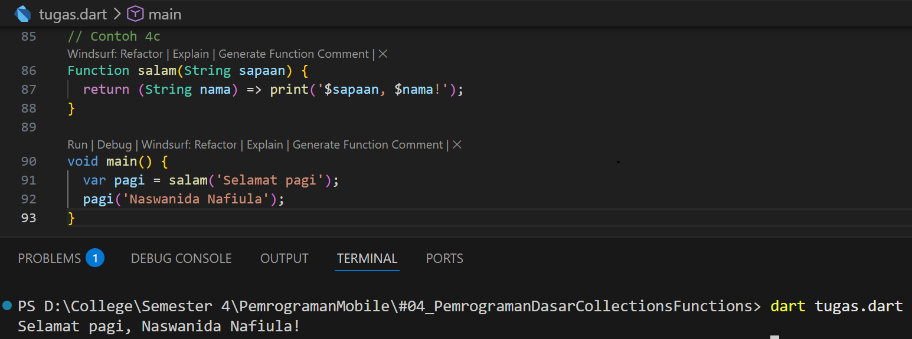

### 5. Apa itu Anonymous Functions? Jelaskan dan berikan contohnya!

**Jawab:**

Anonymous function adalah fungsi tanpa nama yang biasanya digunakan sekali pakai dan langsung diberikan sebagai argumen atau disimpan dalam variabel. Anonymous function sering disebut juga lambda atau closure. Sintaksnya sama seperti fungsi biasa namun tanpa nama fungsi.

**Contoh:**

**a. Disimpan dalam variabel:**
```dart
void main() {
  var sapa = (String nama) {
    print('Halo, $nama!');
  };
  sapa('Sophie');
}
```

Outputnya:
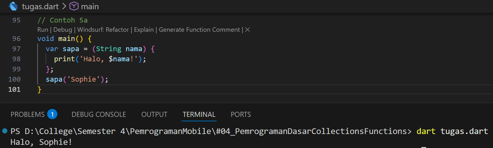

**b. Digunakan langsung sebagai argumen:**
```dart
void main() {
  var mahasiswa = ['Eloise', 'Daphne', 'Nida'];
  mahasiswa.forEach((nama) {
    print('Mahasiswa: $nama');
  });
}
```

Outputnya:
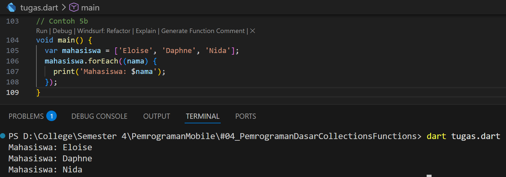

**c. Menggunakan arrow function:**
```dart
void main() {
  var getNIM = (String nama) => 'NIM $nama adalah 244107060063';
  print(getNIM('Naswanida Nafiula'));
}
```

Outputnya:
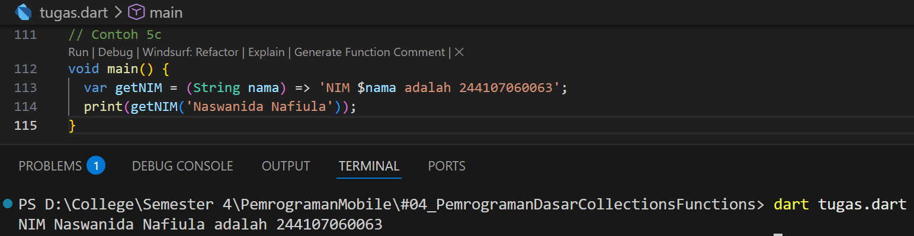

### 6. Jelaskan perbedaan Lexical scope dan Lexical closures! Berikan contohnya!

**Jawab:**

Lexical Scope adalah aturan di mana variabel hanya bisa diakses di dalam blok atau fungsi tempat ia dideklarasikan. Scope ditentukan berdasarkan struktur kode, bisa dibayangkan dengan "mengikuti kurung kurawal ke luar" untuk mengetahui apakah suatu variabel bisa diakses atau tidak.

**Contoh:**
```dart
String nama = 'Naswanida Nafiula';

void main() {
  String nim = '244107060063';

  void tampilData() {
    String prodi = 'D4 Sistem Informasi Bisnis';

    void tampilLengkap() {
      // bisa akses semua variabel di atasnya
      print(nama);
      print(nim);
      print(prodi);
    }

    tampilLengkap();
  }

  tampilData();
}
```

Outputnya:
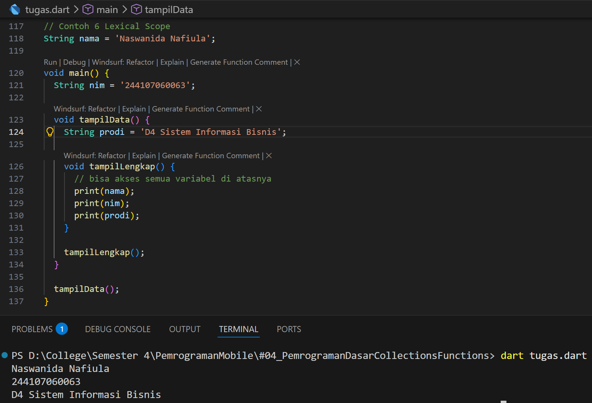

Lexical Closures adalah fungsi yang dapat mengingat dan mengakses variabel dari scope luarnya meskipun fungsi tersebut dieksekusi di luar scope asalnya. Closure "menutup" variabel dari lingkungan sekitarnya.

**Contoh:**
```dart
Function sapaMahasiswa(String nama) {
  return (String matkul) => print('$nama sedang belajar $matkul');
}

void main() {
  var sapa = sapaMahasiswa('Nida');
  sapa('Pemrograman Mobile');
  sapa('Data Warehouse');
}
```

Outputnya:
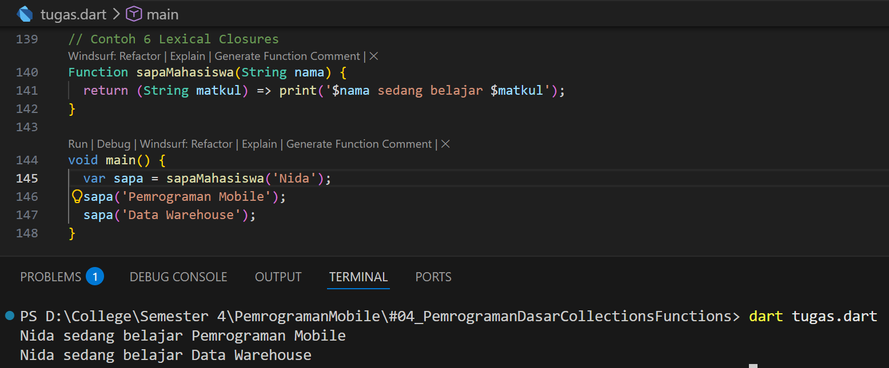

Perbedaan utamanya adalah lexical scope mengatur di mana variabel bisa diakses berdasarkan struktur kode, sedangkan lexical closures memungkinkan fungsi untuk mengingat variabel dari scope luarnya meskipun dieksekusi di tempat lain.

### 7. Jelaskan dengan contoh cara membuat return multiple value di Functions!

**Jawab:**

Dart tidak mendukung return lebih dari satu nilai secara langsung dari sebuah fungsi. Namun ada beberapa cara yang bisa digunakan untuk mengembalikan beberapa nilai sekaligus, yaitu menggunakan List, Map, atau Record.

**Contoh:**

**Menggunakan List**

Cocok digunakan ketika nilai yang dikembalikan bertipe sama atau urutannya sudah jelas

```dart
List<dynamic> getMahasiswa() {
  return ['Nida', 244107060063, 'D4 Sistem Informasi Bisnis'];
}

void main() {
  var data = getMahasiswa();
  print(data[0]);
  print(data[1]);
  print(data[2]);
}
```

Outputnya:
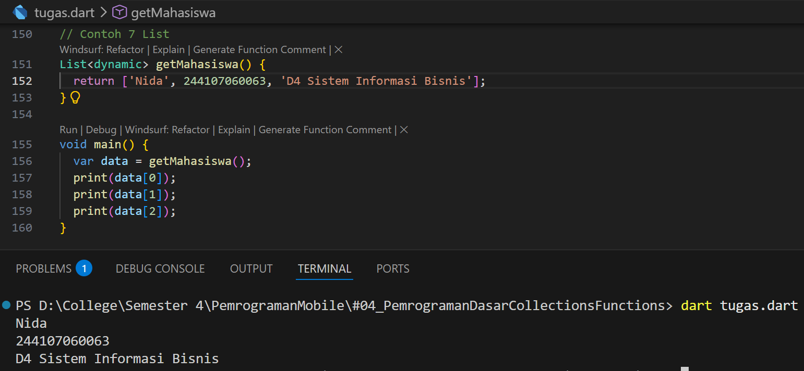

**Menggunakan Map**

Cocok digunakan ketika nilai yang dikembalikan memiliki nama/key yang jelas sehingga lebih mudah dibaca

```dart
Map<String, dynamic> getMahasiswa() {
  return {
    'nama': 'Naswanida Nafiula',
    'nim': 244107060063,
    'hobi': 'Bermain bulutangkis'
  };
}

void main() {
  var data = getMahasiswa();
  print(data['nama']);
  print(data['nim']);
  print(data['hobi']);
}
```

Outputnya:
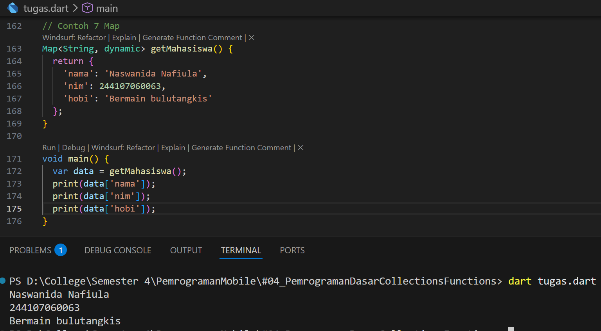

**Menggunakan Record**

Cara terbaru dan paling direkomendasikan di Dart karena lebih ringkas, type-safe, dan langsung bisa melakukan destructuring pada nilai yang dikembalikan

```dart
(String, int, String) getMahasiswa() {
  return ('Naswa', 244107060063, 'SIB 2E');
}

void main() {
  var (nama, nim, kelas) = getMahasiswa();
  print(nama);
  print(nim);
  print(kelas);
}
```

Outputnya:
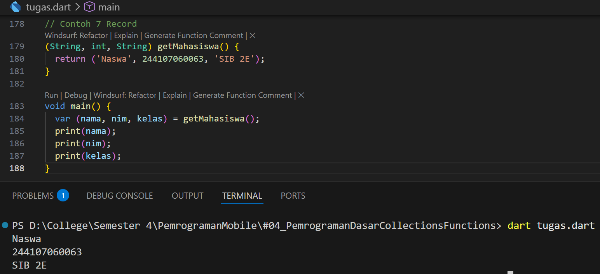