# Laporan Praktikum #07 - Manajemen Plugin

Naswanida Nafiula <br>
SIB 2E / 13 <br>
244107060063 <br>

[Link Repository Praktikum](https://github.com/nideeuw/flutter_plugin_pubdev.git)

---

## Praktikum : Menerapkan Plugin di Project Flutter
### Langkah 1:
Buatlah sebuah project flutter baru dengan nama **flutter_plugin_pubdev**. Lalu jadikan repository di GitHub Anda dengan nama **flutter_plugin_pubdev**.

**Jawab:**

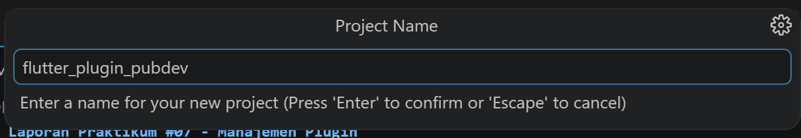

### Langkah 2:
Tambahkan plugin `auto_size_text` menggunakan perintah berikut di terminal
```dart
flutter pub add auto_size_text
```
Jika berhasil, maka akan tampil nama plugin beserta versinya di file `pubspec.yaml` pada bagian dependencies.

**Jawab:**

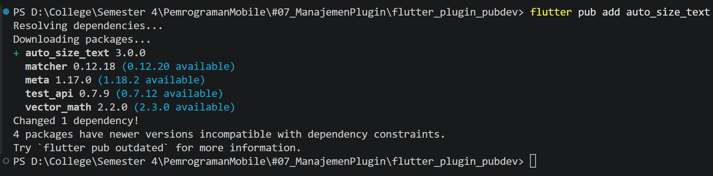

Muncul pada `pubspec.yaml`

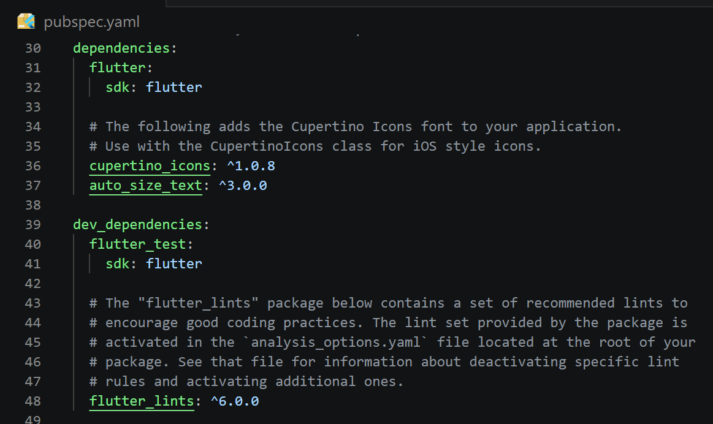

### Langkah 3:
Buat file baru bernama `red_text_widget.dart` di dalam folder lib lalu isi kode seperti berikut.
```dart
import 'package:flutter/material.dart';

class RedTextWidget extends StatelessWidget {
  const RedTextWidget({Key? key}) : super(key: key);

  @override
  Widget build(BuildContext context) {
    return Container();
  }
}
```

**Jawab:**

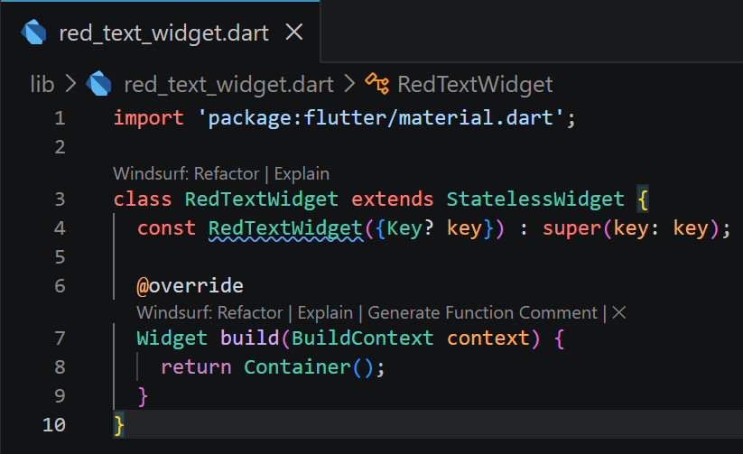

### Langkah 4:
Masih di file `red_text_widget.dart`, untuk menggunakan plugin `auto_size_text`, ubahlah kode `return Container()` menjadi seperti berikut.
```dart
return AutoSizeText(
      text,
      style: const TextStyle(color: Colors.red, fontSize: 14),
      maxLines: 2,
      overflow: TextOverflow.ellipsis,
);
```
Setelah Anda menambahkan kode di atas, Anda akan mendapatkan info error. Mengapa demikian? Jelaskan dalam laporan praktikum Anda!

**Jawab:**

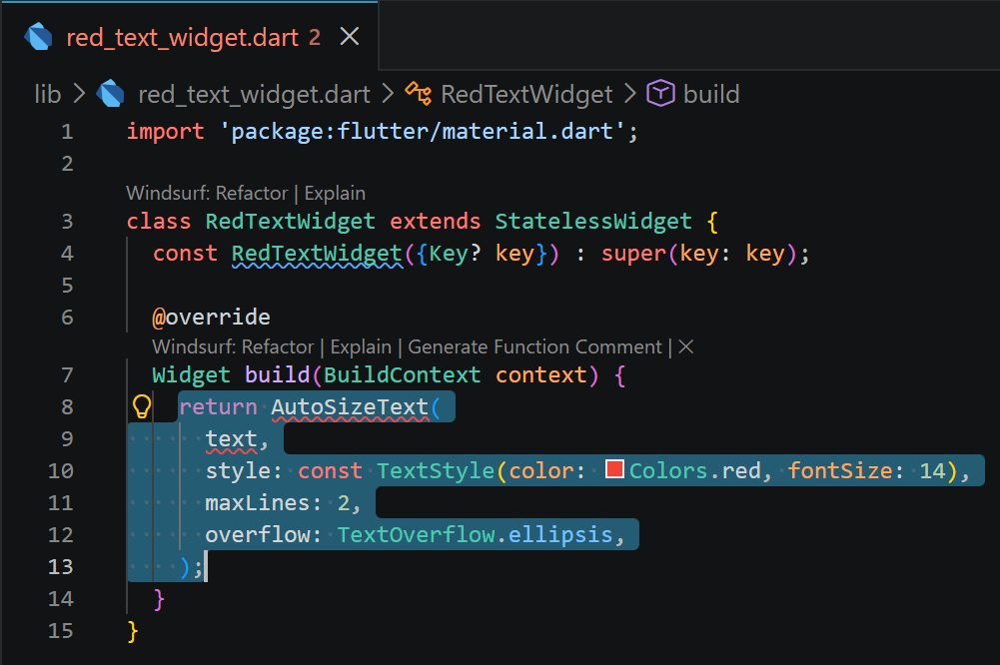

Error terjadi karena `AutoSizeText` berasal dari package eksternal `auto_size_text` yang sudah terinstall di `pubspec.yaml`, namun belum diimport di file `red_text_widget.dart`, sehingga Dart tidak mengenali widget tersebut.

Perbaikan kode dengan import package auto_size_text

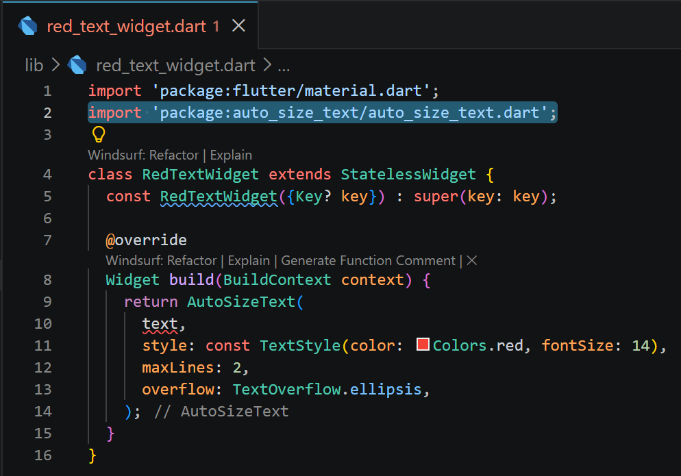

Pada perbaikan tersebut masih ada error yaitu karena `text` belum dideklarasikan. Untuk perbaikan `text` akan diselesaikan pada Langkah 5.

### Langkah 5:
Tambahkan variabel `text` dan parameter di constructor seperti berikut.
```dart
final String text;

const RedTextWidget({Key? key, required this.text}) : super(key: key);
```

**Jawab:**

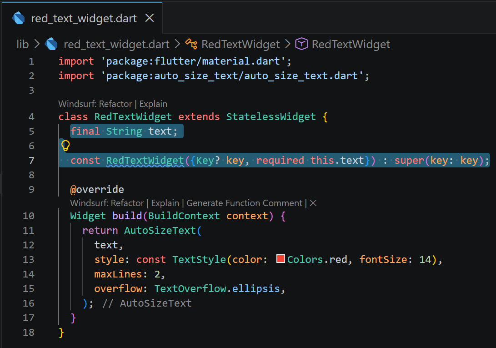

### Langkah 6:
Buka file `main.dart` lalu tambahkan di dalam `children:` pada `class _MyHomePageState`
```dart
Container(
   color: Colors.yellowAccent,
   width: 50,
   child: const RedTextWidget(
             text: 'You have pushed the button this many times:',
          ),
),
Container(
    color: Colors.greenAccent,
    width: 100,
    child: const Text(
           'You have pushed the button this many times:',
          ),
),
```
**Run** aplikasi tersebut dengan tekan **F5**, maka hasilnya akan seperti berikut.

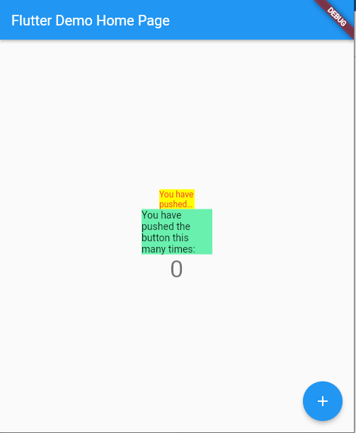

**Jawab:**

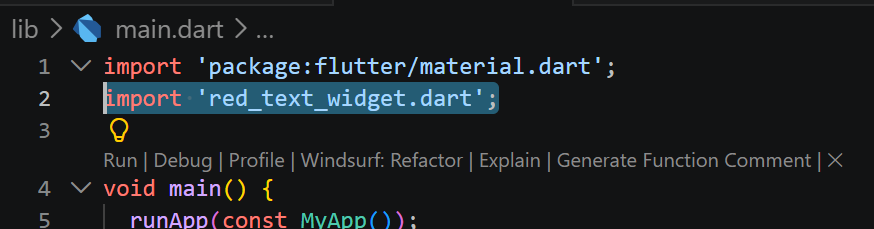

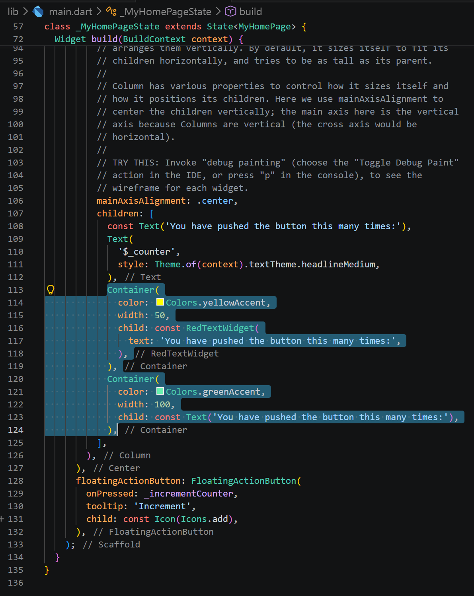

Hasil run aplikasi:

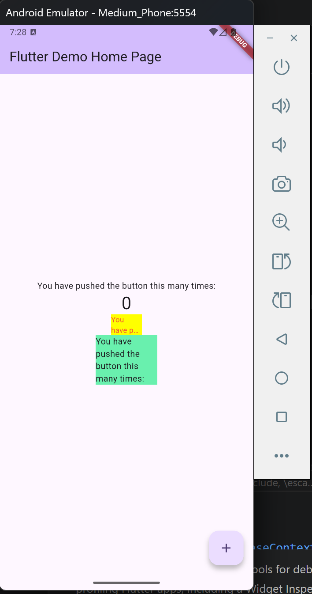

---

## Tugas Praktikum

### 1. Selesaikan Praktikum tersebut, lalu dokumentasikan dan push ke repository Anda berupa screenshot hasil pekerjaan beserta penjelasannya di file `README.md`!

### 2. Jelaskan maksud dari langkah 2 pada praktikum tersebut!

**Jawab:**
Langkah 2 adalah menjalankan perintah `flutter pub add auto_size_text` di terminal. Tujuannya untuk menambahkan package eksternal `auto_size_text` sebagai dependency ke project Flutter, yang secara otomatis menambahkan baris `auto_size_text: ^3.0.0` di `pubspec.yaml` dan mengunduh package tersebut agar bisa digunakan di dalam kode.

### 3. Jelaskan maksud dari langkah 5 pada praktikum tersebut!

**Jawab:**
Langkah 5 adalah mendeklarasikan variabel `text` sebagai field bertipe `String` di dalam class `RedTextWidget`, sekaligus menambahkan `required this.text` di constructor. Tujuannya agar widget ini bisa menerima teks dari luar (parent widget) sebagai parameter, sehingga `RedTextWidget` bersifat reusable dan tidak hardcode teksnya sendiri.

### 4. Pada langkah 6 terdapat dua widget yang ditambahkan, jelaskan fungsi dan perbedaannya!

**Jawab:**
Dua widget yang ditambahkan di Langkah 6 memiliki fungsi yang sama yaitu menampilkan teks, namun dengan cara yang berbeda. Widget pertama adalah `Container` dengan lebar 50px yang menggunakan `RedTextWidget` di dalamnya. Karena `RedTextWidget` memakai `AutoSizeText`, ukuran font akan otomatis diperkecil agar teks muat di dalam container yang sempit, dan jika sudah tidak bisa mengecil lagi maka teks akan terpotong dengan ellipsis `(...)`. Widget kedua adalah `Container` dengan lebar 100px yang menggunakan widget `Text` biasa. Widget ini tidak memiliki kemampuan auto-sizing sehingga ukuran fontnya tetap dan teks bisa overflow jika ruang tidak mencukupi. Perbedaan utamanya terletak pada kemampuan responsif terhadap ukuran container, dimana `RedTextWidget` dengan `AutoSizeText` dapat menyesuaikan diri secara otomatis sedangkan `Text` biasa tidak.

### 5. Jelaskan maksud dari tiap parameter yang ada di dalam plugin `auto_size_text` berdasarkan tautan pada dokumentasi [ini](https://pub.dev/documentation/auto_size_text/latest/) !

**Jawab:**
Plugin `auto_size_text` memiliki berbagai parameter yang dapat digunakan untuk mengatur perilaku teks secara otomatis, berikut penjelasan masing-masing parameternya.

- key: Mengontrol bagaimana satu widget menggantikan widget lain di dalam tree.
- textKey: Menetapkan key untuk widget Text yang dihasilkan.
- style: Style yang digunakan untuk teks, seperti warna, ukuran font, dan sebagainya.
- minFontSize: Ukuran font minimum yang diizinkan saat auto-sizing berlangsung. Diabaikan jika presetFontSizes diset.
- maxFontSize: Ukuran font maksimum yang diizinkan saat auto-sizing berlangsung. Diabaikan jika presetFontSizes diset.
- stepGranularity: Besaran langkah penurunan font size saat menyesuaikan teks dengan constraints yang ada.
- presetFontSizes: Mendefinisikan daftar ukuran font yang boleh digunakan, harus diurutkan secara descending. Jika diset, maka minFontSize, maxFontSize, dan stepGranularity akan diabaikan.
- group: Menyinkronkan ukuran font dari beberapa AutoSizeText sekaligus agar semua memiliki ukuran yang sama.
- textAlign: Menentukan cara teks disejajarkan secara horizontal.
- textDirection: Menentukan arah penulisan teks yang memengaruhi interpretasi nilai textAlign.
- locale: Digunakan untuk memilih font ketika karakter Unicode yang sama bisa ditampilkan berbeda tergantung locale.
- softWrap: Menentukan apakah teks harus memutus baris pada soft line break.
- wrapWords: Menentukan apakah kata yang tidak muat dalam satu baris harus di-wrap. Defaultnya true.
- overflow: Menentukan cara menangani teks yang melebihi batas tampilan.
- overflowReplacement: Widget yang ditampilkan sebagai pengganti jika teks overflow dan tidak muat dalam batasnya.
- textScaleFactor: Jumlah piksel font untuk setiap piksel logis, juga memengaruhi minFontSize, maxFontSize, dan presetFontSizes.
- maxLines: Jumlah maksimum baris yang boleh digunakan oleh teks.
- semanticsLabel: Label semantik alternatif untuk teks ini yang digunakan untuk keperluan aksesibilitas.

### 6. Kumpulkan laporan praktikum Anda berupa link repository GitHub kepada dosen!